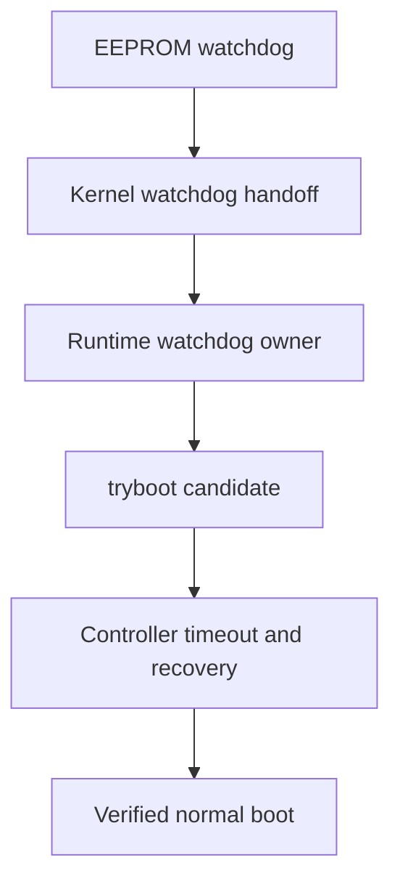

# AutoPiOverclock

**Recoverable, controller-driven Raspberry Pi 5 clock tuning over SSH.**

[](https://github.com/p1r473/AutoPiOverclock/actions/workflows/ci.yml)

## TL;DR — get started

> [!CAUTION]
> Overclocking can crash the target, corrupt storage, damage data, and in unusual cases contribute to hardware damage. `tryboot` and watchdogs reduce risk; they do not eliminate it. Back up the target and do not use this alpha on a system whose outage or corruption you cannot tolerate.

Run AutoPiOverclock from a separate Linux controller. The target must be a 64-bit ARM Raspberry Pi 5 with working SSH key authentication, cooling, normal-boot recovery, and an active watchdog chain.

For a new checkout:

```bash
git clone https://github.com/p1r473/AutoPiOverclock.git
cd AutoPiOverclock
make test
./autopioverclock --version
```

For an existing checkout:

```bash
cd AutoPiOverclock
git switch main
git pull --ff-only origin main
make test
./autopioverclock --version
```

Then connect to the target and begin with read-only discovery:

```bash

# Replace this with the target's real SSH destination.
TARGET=user@target-host

# Review and accept the host key, then separately prove key-only SSH.
command ssh -F /dev/null "$TARGET" true
command ssh -F /dev/null -o BatchMode=yes "$TARGET" true

# Read-only: discover the target and preview the automatic plan.
./autopioverclock prepare "$TARGET" --mode auto

# Mutating: after reviewing prepare, begin the real tuning run.
./autopioverclock run "$TARGET" --mode auto
```

Important shortcuts and stop conditions:

- `prepare` does not write target files or reboot. Resolve every preflight error before `run`.
- `run` can reboot or crash the target and takes many hours; optional edge validation can extend the complete run across multiple days. Add `--yes` only when you want the ordinary tuning confirmation accepted unattended; it never bypasses permanent `apply` confirmation.
- Do not add `--install-missing` unless `prepare` explicitly reports a missing dependency you have reviewed and want AutoPiOverclock to install or stage.
- For the optional edge search, add `--edge-cpu-24h`. It first validates the normal 50 MHz-buffered CPU floor, then runs another complete validation at CPU 25 MHz higher; that second validation's endurance stage alone lasts 24 hours.
- Configuration-free auto mode requires verified firmware-stock clocks and no explicit clock, voltage, or unbound `include` directive. If `prepare` finds an old overclock and you explicitly want to return to stock first, use `./autopioverclock "$TARGET" reset`; it creates a verified backup, reboots, and proves stock settings before reporting success.
- Results are retained under `$HOME/overclock-results` by default. Use `./autopioverclock status "$TARGET"` or `./autopioverclock report "$TARGET"` to inspect them.

AutoPiOverclock tests clock candidates through Raspberry Pi `tryboot`, proves that the target can recover normally after every candidate, and refuses to treat a short benchmark pass as a production recommendation. It is built for repeatability and recovery—not benchmark records.

## Why this exists

Typical overclock testing answers only one question: “Did this workload finish?” AutoPiOverclock also asks:

- Did the target actually boot through `tryboot`?
- Were the requested clocks really active under load?
- Did power, temperature, storage, USB, GPU, display, audio, services, and kernel health remain clean?
- Did every recovery boot return to the protected permanent normal configuration?
- Is the proposed production clock backed off from the maximum observed pass?
- Did the final clocks survive a separate eight-hour validation—and, when requested, did CPU 25 MHz higher survive a fresh 24-hour edge validation?

The tool deliberately records distinct result concepts instead of collapsing every pass into one number:

| Result | Meaning |
| --- | --- |
| Maximum observed pass | Highest candidate that completed its candidate gates. |
| Guarded production target | Explicit-plan backoff, or the candidate-tested automatic CPU/GPU guard selected for ordinary final validation. |
| Validated production floor | Automatic guarded target after the ordinary eight-hour validation; preserved separately when optional edge testing is requested. |
| Optional CPU edge | Production-floor CPU plus 25 MHz, tested for 24 hours; a safely rejected edge retains the validated floor, while a pass becomes the final CPU result. |
| Final validated clock | The completed ordinary floor or successful optional edge result recorded under the current validation schema. |

## Safety invariants

- Permanent `config.txt` is hashed and protected throughout testing.
- Candidate values are written only to `tryboot.txt`.
- A live `run` refuses to start if any `tryboot.txt` already exists; it never overwrites an operator-owned or unknown recovery file.
- Every project-created `tryboot.txt` is bound to the current attempt by a fresh random ownership token and recorded SHA-256 evidence. Creation is no-clobber, trigger re-verifies the completed file, and cleanup quarantines then re-verifies it after a normal recovery before removal.
- Candidate clock values are never written to permanent configuration by `run`, `prepare`, `resume`, or `recover`; the separately confirmed watchdog-remediation path is the only non-`apply` exception for permanent watchdog settings.
- Every candidate includes repeated candidate boots, normal recoveries, stress, health checks, and a final normal boot.
- Active EEPROM, kernel, runtime, and userspace-watchdog evidence is required before tuning.
- Historical sticky throttle bits are separated from current or newly observed failures.
- Failed, missing, late, or malformed evidence fails closed.
- Tryboot staging/trigger/cleanup, normal reboot, stock reset, watchdog repair, permanent apply, and rollback share one target-side atomic lock, so independent controllers cannot overlap boot-critical mutations.
- Existing run artifacts are retained; only `*-latest.*` links are updated.
- `apply` requires a fully validated current-schema result, shows an exact diff, and demands a separate typed confirmation.



## Supported targets

“Supported” means the platform has an implemented, fixture-covered alpha path. It does not mean that every hardware/firmware combination has completed end-to-end qualification.

| Target | Status | Notes |
| --- | --- | --- |
| Raspberry Pi OS | Supported | 64-bit ARM Raspberry Pi boot layout. |
| Debian | Supported | 64-bit ARM; `/boot/firmware/config.txt` or `/boot/config.txt`. |
| Ubuntu | Supported | 64-bit ARM Raspberry Pi boot layout only. |
| Batocera | Supported | 64-bit ARM Buildroot; read-only `/boot` handling and graphical gates. |
| Arch Linux | Not supported | Outside the v1 scope. |
| Generic Linux distributions | Not supported | Detection is intentionally narrow. |

Batocera is treated as Buildroot, not Arch Linux. AutoPiOverclock never attempts an in-place glibc upgrade on Batocera.

## Current validation status

This repository is alpha software. Automated fixtures are not a substitute for Raspberry Pi hardware evidence, and the live CI badge above is the authoritative status for the current GitHub commit.

As of 2026-08-26, an `alpha.16` Debian-family run safely recovered from an unexpected reboot during the 3200 MHz CPU candidate but exposed a controller-classification gap. `alpha.17` fixes that gap; resumed Debian-family validation and the Batocera run still require completed artifact review, so this README intentionally makes no hardware-pass or production-clock claim.

| Evidence | Current status |
| --- | --- |
| Bash fixture suite | 14 scripted suites cover parsing, state, classification, workers, tryboot, watchdogs, selection, resume, apply, reset, packaging, and public-safety contracts. |
| GitHub CI and ShellCheck | See the live badge for the current commit. |
| Debian-family Raspberry Pi 5 run | `alpha.16` autonomous normal recovery at the 3200 MHz candidate succeeded; `alpha.17` resume and final validation remain pending. |
| Batocera Raspberry Pi 5 run | Overnight validation outcome remains pending retained-artifact review. |
| Eight-hour production-floor validation | No public PASS claim until the retained run artifacts complete and are reviewed. |
| Optional 24-hour CPU edge validation | No public PASS claim until the production floor passes first and the edge artifacts are reviewed. |

Do not infer a production recommendation from a candidate pass, an active run, or this table. Only a run that reaches `COMPLETE` and records `Validated: 1` under the current validation schema is a final validated result; `apply` remains a separate operation with fresh live safety checks and typed confirmation.

## Controller prerequisites

- Bash 4.3 or newer.
- `git` and GNU Make for the clone-and-test commands shown below; `tar`, `zip`, and `unzip` for the packaging fixture.
- Noninteractive SSH key authentication.
- `sudo -n` on a non-root Debian-family target, or an explicitly supplied root target where appropriate.
- Local `ssh`, `awk`, `sed`, `grep`, `date`, `mktemp`, `sha256sum`, `base64`, `diff`, `cmp`, `flock`, `od`, `tr`, and `sync`.
- Remote `/bin/bash`.
- A 64-bit ARM (`aarch64`/`arm64`) Raspberry Pi 5 target with tested power, cooling, backups, and a working normal boot.

AutoPiOverclock runs `command ssh -F /dev/null`; user SSH aliases and wrappers are intentionally bypassed. First review and accept the target host key interactively, then prove that authentication also succeeds in batch mode without a password prompt:

```bash
command ssh -F /dev/null user@target true
command ssh -F /dev/null -o BatchMode=yes user@target true
```

If `user@` is omitted, the controller's current `id -un` value becomes the SSH username. The tool never silently assumes `pi` or `root`.

## Detailed first hardware run

Start as a new user would: do not import remembered clocks or assumptions from an older tuning script. Run read-only discovery with no configuration file:

```bash
./autopioverclock prepare target-host --mode auto
```

Review the detected platform, graphical/headless mode, permanent normal clocks, voltage and its evidence source, power history, boot paths, permanent hash, exact dependency evidence, watchdog chain, and `tryboot.txt` status in the generated discovery and summary artifacts under `$HOME/overclock-results` (or the selected `--output-dir`). A live run requires the discovered tryboot file status to be `ABSENT`.

Configuration-free auto mode accepts only the verified active Raspberry Pi 5 stock tuple: CPU 2400 MHz, V3D 800 or 960 MHz according to the active firmware generation, and zero voltage delta. The worker hashes the permanent root boot config before and after auditing it; any snapshot change or read ambiguity fails closed. It rejects explicit `arm_boost`, `force_turbo`, `initial_turbo`, `core_freq_fixed`, any `*_freq` or `*_freq_min` assignment, and any `over_voltage*` assignment. An `include` directive also fails closed because included files are not yet bound to the protected permanent-config hash. This distinguishes a firmware-default 960 MHz V3D clock from a user-written 960 MHz override. `prepare` and `run` never rewrite permanent clocks to manufacture a baseline. Returning a target to firmware stock defaults is the separate, explicit postfix `TARGET reset` operation documented below.

Resolve preflight findings before tuning:

- `Dependencies: NOT READY` means a live run will refuse to continue unless the reviewed run explicitly includes `--install-missing`.
- `Watchdogs: NOT READY` means no tryboot testing may begin. Debian-family targets can enter the separately confirmed `--repair-watchdogs` path. Batocera watchdog ownership is installation-specific, so automatic repair is refused; configure and verify that chain outside AutoPiOverclock, then repeat `prepare`.
- Any active power/throttle condition, present or unknown tryboot file, missing telemetry, unhealthy graphical baseline, or unexpected permanent clock is a stop condition rather than a candidate result. Inspect and resolve an existing tryboot file explicitly; AutoPiOverclock will not replace it.

With `--mode auto` and no configuration file, AutoPiOverclock proves the stock baseline first and never asks for clock parameters. CPU candidates climb from 2500 MHz in 100 MHz steps through 3200 MHz. From an 800 MHz firmware-stock V3D baseline, GPU candidates begin at 850 MHz; from a 960 MHz firmware-stock baseline, they begin at the next 50 MHz grid point, 1000 MHz. Both climb in 50 MHz steps through 1200 MHz. After the first genuine boot/stability boundary, the last passing-to-failing gap is retested in 25 MHz steps. The production target is itself candidate-tested and kept 50 MHz below the CPU boundary and 25 MHz below the GPU boundary. If a ceiling passes without a failure, the same guards are applied below the highest ceiling pass. Voltage remains zero in configuration-free auto mode.

```bash
./autopioverclock run target-host --mode auto
```

The generated run persists its complete effective configuration for repeatability. `prepare --mode auto` previews the same baseline-relative ladder without changing the target. Before a live run's ordinary confirmation, the controller prints the freshly rediscovered baseline, generated candidates, test voltage, and permanent hash; answer no if they differ from the reviewed `prepare`. `--mode auto` removes parameter-entry prompts, but it does not bypass this safety confirmation; use the separate `--yes` option only when unattended confirmation is intended.

`--edge-cpu-24h` is an optional configuration-free auto extension. It first completes the ordinary eight-hour validation at the 50 MHz-buffered CPU production floor. Only then does it try CPU 25 MHz higher, with GPU unchanged, through a fresh 24-hour complete validation. A genuine edge boot/stability failure that recovers normally retains the already-validated production floor; harness or recovery failures still stop the run.

For a custom plan, copy the matching template, fill its deliberately empty lists after discovery, and review it with `prepare` before `run`. An explicit configuration file remains authoritative and is never auto-filled:

```bash
cp examples/debian-headless.conf my-target.conf
./autopioverclock prepare target-host --mode auto --config my-target.conf
./autopioverclock run target-host --mode auto --config my-target.conf
```

The templates contain no clock values and are not recommendations.

After any explicitly approved dependency/watchdog remediation and the ordinary run confirmation, the first tuning phase is a dedicated recovery proof: it writes the discovered normal clocks to a token-bound, hash-recorded candidate `tryboot.txt`, re-verifies that exact completed file immediately before trigger, boots through tryboot, verifies the flag/clocks/health/watchdogs, reboots normally, proves the flag cleared and the permanent hash unchanged, quarantines and re-verifies only that owned file before removal, then requires the complete normal health and watchdog gate to pass. Any mismatch, foreign replacement, or failed cleanup is preserved as evidence and stops the run before fresh clock candidates. Any graphical or GPU plan then runs a 20-second GPU harness smoke before its first clock candidate; Batocera graphical mode binds an off-screen Wayland workload to the verified live EmulationStation session without stopping the frontend or taking DRM/VT ownership, and requires a hardware V3D renderer, a positive completed score, zero exit, requested-clock evidence, and an unchanged graphical/audio baseline.

Unlike `prepare`, a live `run` is not read-only. Before the ordinary tuning confirmation, it stages a run-isolated target worker; if the target is already booted through tryboot, it may reboot to the permanent normal configuration before baseline discovery. An explicitly requested `--install-missing` may stage dependencies during preflight, and `--repair-watchdogs` may enter its own separately confirmed permanent watchdog-remediation path. Use `prepare` when you require a mutation-free review. After the ordinary tuning confirmation, `run` executes filesystem writeability probes and begins the recovery proof and candidate sequence. The worker path includes the collision-resistant run ID so concurrent controllers cannot replace or delete each other's recovery worker. Candidate clocks remain confined to a random-token-owned `tryboot.txt`, which is hash checked before trigger and quarantined/re-verified after each normal recovery, until a separately validated and confirmed `apply`.

### Custom configured sweep, after reviewed prepare

```bash
./autopioverclock run target-host --config my-target.conf
```

Batocera may require a portable GPU payload. Review the read-only plan first; dependency staging occurs only when a mutating run is explicitly given `--install-missing`. The supported bundle-builder path is an ARM64 Debian-family controller with `apt-get`, `dpkg-deb`, Debian package access, `sha256sum`, and `tar`; see [`docs/batocera.md`](docs/batocera.md).

```bash
./autopioverclock run root@target-host --mode graphical --config my-batocera.conf --install-missing
```

## Commands

| Command | Purpose |
| --- | --- |
| `run` | Prepare, prove recovery, sweep, select conservatively, and validate. |
| `prepare` | Read-only discovery and plan generation. |
| `resume` | Recover an interrupted tryboot when necessary and continue saved progress. |
| `status` | Show local state for the selected or latest run; supports redaction. |
| `recover` | Return the target to permanent normal configuration and verify health. |
| `apply` | Apply only a fully validated result after an exact diff and typed confirmation. |
| `report` | Generate a concise run report; supports redaction. |
| `TARGET reset` | Back up the permanent boot config, disable explicit clock/voltage overrides, reboot normally, and verify firmware stock defaults. |

The approved options and command-specific rules are documented in [`docs/cli.md`](docs/cli.md). No short aliases or hidden public switches are accepted.

## Configuration

Configuration files are strict, data-only `KEY=VALUE` files. They are parsed, never sourced.

```ini
cpu_candidates_mhz=
gpu_candidates_mhz=
voltage_delta_uv=existing
candidate_duration_seconds=600
final_duration_seconds=28800
max_temp_c=75
telemetry_interval_seconds=5
conservative_backoff_steps=1
candidate_boots=2
final_boots=3
required_services=
frontend_process=
audio_sink_pattern=
```

This discovery-first template is valid for `prepare`. When an explicit configuration file is supplied, fill at least one candidate list before `run`; the controller will not replace blank configured domains with automatic values. Candidate lists must be strictly increasing, an empty list skips that tuning domain, and a configured `run` must contain at least one CPU or GPU candidate. Without `--config`, `--mode auto` requires the stock tuple and generates and persists the bounded coarse lists described above; refinement and MHz guards are checkpointed separately in run state.

`voltage_delta_uv=existing` preserves the target's existing value; AutoPiOverclock never silently raises voltage. `final_duration_seconds` cannot be shorter than 28,800 seconds, candidate boots cannot be lower than two, and final boot/recovery cycles cannot be lower than three.

| Key | Meaning and accepted values |
| --- | --- |
| `cpu_candidates_mhz` | Strictly increasing comma-separated CPU clocks; each value 600–4000 MHz. Empty skips CPU tuning. |
| `gpu_candidates_mhz` | Strictly increasing comma-separated V3D clocks; each value 200–3000 MHz. Empty skips GPU tuning. |
| `voltage_delta_uv` | `existing`, or an explicit 0–100000 microvolt delta. |
| `candidate_duration_seconds` | Stress duration for each candidate and each final CPU/GPU-only gate; 10–86400 seconds. |
| `final_duration_seconds` | Combined endurance duration; 28800–604800 seconds. |
| `max_temp_c` | Exclusive temperature ceiling; 40–95 °C. Reaching the ceiling fails the candidate. |
| `telemetry_interval_seconds` | Temperature, clocks, throttle, and kernel-error sampling cadence; 1–60 seconds. Workload supervision still runs every second. |
| `conservative_backoff_steps` | Explicit-plan positions to step down from the maximum observed pass; 0–10. Configuration-free auto uses its fixed MHz guards instead. |
| `candidate_boots` | Candidate/normal recovery cycles before candidate stress; 2–10. |
| `final_boots` | Post-endurance candidate/normal recovery cycles; 3–10. |
| `required_services` | Optional comma-separated service names that must remain active. |
| `frontend_process` | Optional single process name that must remain present. |
| `audio_sink_pattern` | Optional literal substring required in the default audio-sink inspection. |

## What every candidate must prove

- SSH returns after the expected boot.
- The firmware reports an active `tryboot` candidate.
- Requested clocks are observed under load within tolerance.
- Current/new throttle and undervoltage evidence remains clean.
- Temperature remains below the configured ceiling.
- No new filesystem, storage, USB-reset, GPU, kernel panic/internal error/Oops, RCU-stall, hung-task, or watchdog fault appears.
- The stress process exits successfully and within its hard deadline.
- Graphical runs always preserve the captured display baseline. Debian also preserves a default audio sink when discovery captured one or `audio_sink_pattern` requires one; Batocera graphical runs require and preserve both display and audio baselines.
- Required services and processes remain healthy.
- Permanent configuration retains its original SHA-256 hash.
- The following recovery boot clears `tryboot` and passes normal health checks.

GPU harness failures are kept separate from clock-stability failures. A required graphical or headless backend that cannot launch, bind the hardware V3D renderer, complete with a positive score and zero exit, or preserve its required display/audio baseline is a `HARNESS_FAILURE`, not proof that the tested GPU clock is unstable. Batocera graphical testing uses an off-screen Wayland workload on the live EmulationStation compositor; it does not take DRM master or stop and restore the frontend.

Stress timing is fail-closed. Batocera CPU load uses exactly one 16 KiB SHA-256 benchmark measured in elapsed time, so the requested duration is the total workload duration rather than a per-buffer-size duration. Workloads retain a separate 60-second shutdown deadline after their requested duration, and controller SSH/reboot budgets include wall time spent inside connection attempts instead of silently stretching a nominal recovery timeout.

## Recovery and resume

Each candidate and final-validation substage is checkpointed atomically. The random ownership token, completed-file hash, reservation hash, and token-specific quarantine path are saved before remote creation can begin. If the controller exits while `tryboot` may be active, its exit trap attempts normal recovery. `resume` repeats recovery first whenever saved or live evidence says the target may still be in `tryboot`, verifies normal recovery, and cleans only token/hash-matching project evidence; an unknown or changed path is preserved and fails closed.

An SSH timeout alone remains `HARNESS_FAILURE`. During an active stress stage, it becomes `STABILITY_FAILURE` only when recovery proves that the exact saved candidate boot ID already changed to a clear normal boot before the controller requested any reboot. This captures a proven autonomous candidate reboot without assigning an unverified cause or turning a same-boot network interruption into false silicon evidence; any failed normal recovery remains `RECOVERY_FAILURE`.

```bash
./autopioverclock status target-host --run-id RUN_ID
./autopioverclock report target-host --run-id RUN_ID
./autopioverclock resume target-host --run-id RUN_ID
./autopioverclock recover target-host --run-id RUN_ID
```

Use the explicit run ID whenever more than one retained run exists; a reset audit also advances the target's `*-latest` links. `resume` is only for a run interrupted after the ordinary tuning confirmation created resumable tuning state. A preflight failure or declined tuning confirmation remains available through `status` and `report`; resolve the finding and start a new `run` instead of resuming it. Evidence tied to an interrupted candidate boot is repeated when it cannot be preserved safely. A state file from an older safety schema cannot be resumed through newer gates.

### Reset a target to verified stock defaults

Reset is an explicit postfix target action. The order is exact:

```bash
./autopioverclock target-host reset
```

`run reset` and a lone `reset` retain their historical meaning: they run against a host literally named `reset`. There is no command-first `reset target-host` alias and no `--reset` option. The postfix action is noninteractive, so it neither needs nor accepts `--yes`. It also rejects `--run-id`, tuning/configuration flags, dependency/watchdog flags, dry-run, edge-validation, mode, and redaction flags; only `--output-dir`, `--ssh-port`, and `--identity-file` may accompany it.

Before changing the permanent root boot config, reset requires a regular non-symlink config, a stable expected hash, no active `include` directive, and no foreign or ambiguous `tryboot.txt`/quarantine path. It writes a hash-verified, no-clobber backup under `/var/lib/autopioverclock/backups/` on Debian-family systems or `/userdata/system/autopioverclock/backups/` on Batocera. Standalone boost, fixed-clock, `*_freq`/`*_freq_min`, and `over_voltage*` lines are retained as comments prefixed with `# AUTOPIOVERCLOCK-STOCK-DISABLED`; the clock directives and markers in one structurally valid AutoPiOverclock managed block are removed while its `[all]` section boundary is retained, with the complete original bytes in the verified backup. An attributable AutoPiOverclock tryboot artifact is backed up before removal, while unknown paths are preserved and reset fails closed. If the running firmware reports a tryboot boot but no live or quarantined path exists, reset does not claim ownership of that boot; it safely prepares the backed-up permanent stock config, forces a normal reboot, and requires the post-reboot tryboot flag to be clear. Batocera must also restore and verify `/boot` read-only.

Reset then forces a permanent-config reboot and accepts success only after a new boot ID, an exact expected config hash, an absent/cleared tryboot state, and active Raspberry Pi 5 stock clocks are all verified: CPU 2400 MHz, firmware-default V3D 800 or 960 MHz, and zero voltage delta. The same verification checks current throttle/power state and the active watchdog chain; reset does not claim the broader display, audio, service, or workload health gates used by tuning. A reset creates its own audit state/log and reports the remote backup path; it never deletes or truncates prior logs, state, summaries, candidate logs, or saved runs.

Reset does not run `tmux`, Byobu, job-control, or process-wide kill commands. If another controller still owns the per-target lock, reset fails without signaling that process or its terminal session; stop that one foreground controller yourself and repeat the exact postfix command.

## Results

All targets and runs share one flat output directory, `$HOME/overclock-results` by default. There are no per-host subdirectories, and prior runs are never deleted. A typical tuning run creates the following artifacts; a standalone reset creates its own audit state/log/summary/CSV/JSON but intentionally does not manufacture a tuning `.conf` or candidate logs.

```text
target-20260823-010000-a1b2c3d4e5f60708.log
target-20260823-010000-a1b2c3d4e5f60708.csv
target-20260823-010000-a1b2c3d4e5f60708.json
target-20260823-010000-a1b2c3d4e5f60708.state
target-20260823-010000-a1b2c3d4e5f60708.conf
target-20260823-010000-a1b2c3d4e5f60708.jsonl
target-20260823-010000-a1b2c3d4e5f60708-discovery.txt
target-20260823-010000-a1b2c3d4e5f60708-summary.txt
target-20260823-010000-a1b2c3d4e5f60708-cpu-CLOCK_gpu-CLOCK-candidate.log
target-latest.log
target-latest-summary.txt
target-latest.state
target-latest.json
```

See [`docs/output.md`](docs/output.md) for artifact fields and failure classifications.

## Applying a validated result

Candidate tuning never writes candidate clocks to permanent `config.txt`. The separately confirmed watchdog-repair path may edit permanent watchdog settings, `TARGET reset` backs up and disables explicit permanent tuning, and only `apply` writes fully validated clock results. After a tuning result completes the current validation schema and at least eight hours of final validation:

```bash
./autopioverclock apply target-host --run-id RUN_ID
```

Use the validated tuning run's explicit ID from `status` or its artifact names. This matters because a later standalone reset creates its own audit run and advances the target's `*-latest` links without turning that reset audit into an applyable tuning result. `apply` verifies a fresh normal boot and the protected permanent hash, displays the exact proposed diff, and requires typing `APPLY target-slug run-id`. `--yes` cannot bypass that confirmation or EEPROM-remediation confirmation.

## Repository layout

```text
autopioverclock       command dispatcher
lib/                  controller libraries
profiles/             supported target profiles
workers/              target-side workers
tests/                fixture and safety tests
examples/             approved configuration examples
tools/                packaging and Batocera bundle tooling
docs/                 design, safety, CLI, output, and platform notes
```

## Development

```bash
make test
make lint
make package
```

`make lint` requires ShellCheck. Changes to public commands, options, or the configuration schema require project-owner approval before implementation. Every new failure signature should include a fixture.

## License and security

AutoPiOverclock is licensed under the [Apache License 2.0](LICENSE). See [`CONTRIBUTING.md`](CONTRIBUTING.md) before submitting changes.

Do not post hostnames, addresses, SSH configuration, service names, logs, credentials, or unredacted run data in public issues. Follow [`SECURITY.md`](SECURITY.md) for private vulnerability reporting.
