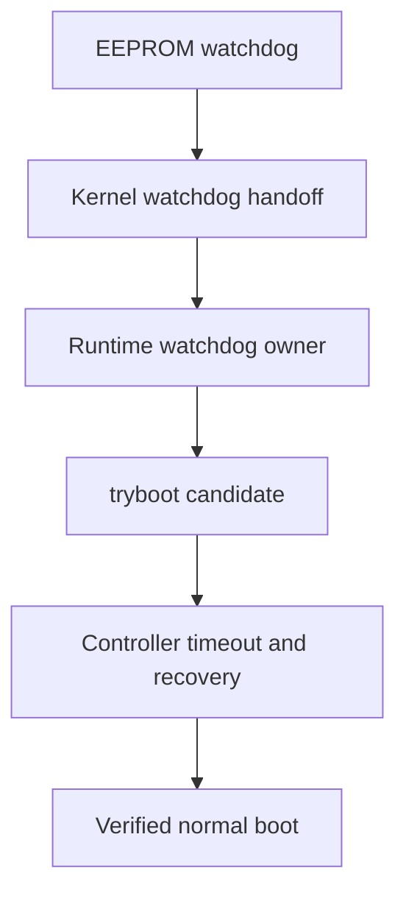

# AutoPiOverclock

**Recoverable, controller-driven Raspberry Pi 5 clock tuning over SSH.**

[](https://github.com/p1r473/AutoPiOverclock/actions/workflows/ci.yml)

AutoPiOverclock tests clock candidates through Raspberry Pi `tryboot`, proves that the target can recover normally after every candidate, and refuses to treat a short benchmark pass as a production recommendation.

It is built for repeatability and recovery—not benchmark records.

> [!CAUTION]
> Overclocking can crash the target, corrupt storage, damage data, and in unusual cases contribute to hardware damage. `tryboot` and watchdogs reduce risk; they do not eliminate it. Back up the target and do not use this alpha on a system whose outage or corruption you cannot tolerate.

## Why this exists

Typical overclock testing answers only one question: “Did this workload finish?” AutoPiOverclock also asks:

- Did the target actually boot through `tryboot`?
- Were the requested clocks really active under load?
- Did power, temperature, storage, USB, GPU, display, audio, services, and kernel health remain clean?
- Did every recovery boot return to the untouched permanent configuration?
- Is the proposed production clock backed off from the maximum observed pass?
- Did the final clocks survive a separate eight-hour validation?

The tool deliberately records three different results:

| Result | Meaning |
| --- | --- |
| Maximum observed pass | Highest candidate that completed its candidate gates. |
| Recommended clock | Conservative selection after the configured backoff. |
| Final validated clock | Recommendation that completed the full final-validation sequence. |

## Safety invariants

- Permanent `config.txt` is hashed and protected throughout testing.
- Candidate values are written only to `tryboot.txt`.
- A live `run` refuses to start if any `tryboot.txt` already exists; it never overwrites an operator-owned or unknown recovery file.
- Every project-created `tryboot.txt` is bound to the current attempt by a fresh random ownership token and recorded SHA-256 evidence. Creation is no-clobber, trigger re-verifies the completed file, and cleanup quarantines then re-verifies it after a normal recovery before removal.
- Candidate clock values are never written to permanent configuration by `run`, `prepare`, `resume`, or `recover`; the separately confirmed watchdog-remediation path is the only non-`apply` exception for permanent watchdog settings.
- Every candidate includes repeated candidate boots, normal recoveries, stress, health checks, and a final normal boot.
- Active EEPROM, kernel, runtime, and userspace-watchdog evidence is required before tuning.
- Historical sticky throttle bits are separated from current or newly observed failures.
- Failed, missing, late, or malformed evidence fails closed.
- Tryboot staging/trigger/cleanup, normal reboot, watchdog repair, permanent apply, and rollback share one target-side atomic lock, so independent controllers cannot overlap boot-critical mutations.
- Existing run artifacts are retained; only `*-latest.*` links are updated.
- `apply` requires a fully validated current-schema result, shows an exact diff, and demands a separate typed confirmation.



## Supported targets

| Target | Status | Notes |
| --- | --- | --- |
| Raspberry Pi OS | Supported | Raspberry Pi boot layout. |
| Debian | Supported | `/boot/firmware/config.txt` or `/boot/config.txt`. |
| Ubuntu | Supported | Raspberry Pi boot layout only. |
| Batocera | Supported | Buildroot; read-only `/boot` handling and graphical gates. |
| Arch Linux | Not supported | Outside the v1 scope. |
| Generic Linux distributions | Not supported | Detection is intentionally narrow. |

Batocera is treated as Buildroot, not Arch Linux. AutoPiOverclock never attempts an in-place glibc upgrade on Batocera.

## Current validation status

This repository is alpha software. Passing fixtures is not a substitute for Raspberry Pi hardware evidence.

| Gate | Status |
| --- | --- |
| Bash syntax and fixture suite | Passing locally |
| Clean tar/ZIP extraction and fixture rerun | Passing locally |
| GitHub CI and ShellCheck | Passing |
| Debian/Raspberry Pi OS live recovery test | Pending alpha.5 hardware run |
| Batocera V3D renderer smoke test | Pending alpha.5 hardware run |
| Eight-hour final validation | Not yet completed |

No production clock recommendation should be taken from this table until the corresponding real-hardware run is complete.

## Controller prerequisites

- Bash 4.3 or newer.
- `git` and GNU Make for the clone-and-test commands shown below; `tar`, `zip`, and `unzip` for the packaging fixture.
- Noninteractive SSH key authentication.
- `sudo -n` on a non-root Debian-family target, or an explicitly supplied root target where appropriate.
- `ssh`, `awk`, `sed`, `grep`, `date`, `mktemp`, `sha256sum`, `base64`, `diff`, `cmp`, `flock`, `od`, and `tr`.
- A Raspberry Pi 5 target with tested power, cooling, backups, and a working normal boot.

AutoPiOverclock runs `command ssh -F /dev/null`; user SSH aliases and wrappers are intentionally bypassed. Accept the target host key first:

```bash
command ssh -F /dev/null user@target true
```

If `user@` is omitted, the controller's current `id -un` value becomes the SSH username. The tool never silently assumes `pi` or `root`.

## Quick start

Clone from the directory you are currently in. `pwd` shows that directory, and Git creates the retained `AutoPiOverclock` checkout directly inside it:

```bash
pwd
git clone https://github.com/p1r473/AutoPiOverclock.git
cd AutoPiOverclock
make test
```

The quick start does not switch directories before cloning and does not use or discard a temporary directory. After the fixtures pass, begin read-only target discovery:

```bash
./autopioverclock prepare target-host --mode auto
```

`prepare` performs read-only discovery and produces a plan. It does not write target files or request a reboot.

### First real-hardware run: discover, then tune

Start as a new user would: do not import remembered clocks or assumptions from an older tuning script. Run read-only discovery with no configuration file:

```bash
./autopioverclock prepare target-host --mode auto
```

Review the detected platform, graphical/headless mode, permanent normal clocks, voltage and its evidence source, power history, boot paths, permanent hash, exact dependency evidence, watchdog chain, and `tryboot.txt` status in the generated discovery and summary artifacts under `$HOME/overclock-results` (or the selected `--output-dir`). A live run requires the discovered tryboot file status to be `ABSENT`.

`prepare` reports the current permanent baseline; it cannot certify from clock readings alone that the target is factory-stock. If a from-scratch test requires factory defaults, independently inspect the permanent boot configuration and stop if it contains an existing overclock or if stock status cannot be established. Backing up and restoring factory configuration is a separate, explicitly reviewed permanent operation outside a tuning run.

Resolve preflight findings before tuning:

- `Dependencies: NOT READY` means a live run will refuse to continue unless the reviewed run explicitly includes `--install-missing`.
- `Watchdogs: NOT READY` means no tryboot testing may begin. Debian-family targets can enter the separately confirmed `--repair-watchdogs` path. Batocera watchdog ownership is installation-specific, so automatic repair is refused; configure and verify that chain outside AutoPiOverclock, then repeat `prepare`.
- Any active power/throttle condition, present or unknown tryboot file, missing telemetry, unhealthy graphical baseline, or unexpected permanent clock is a stop condition rather than a candidate result. Inspect and resolve an existing tryboot file explicitly; AutoPiOverclock will not replace it.

AutoPiOverclock does not invent the first candidate ladder or optimize voltage. Build fresh, strictly increasing candidates from the reviewed baseline and cooling/power evidence; every supplied candidate must be above that domain's discovered normal clock. The result can only be the best value among the candidates actually tested. For the simplest public path, start `run` without a config and enter those CPU and GPU lists at its two guided prompts:

```bash
./autopioverclock run target-host --mode auto
```

The guided run persists its complete effective configuration for repeatability. It defaults to `voltage_delta_uv=existing`, holding voltage constant so the first experiment changes one class of variable at a time. Before its ordinary confirmation, it prints the freshly rediscovered baseline, candidates, test voltage, and permanent hash; answer no if they differ from the reviewed `prepare`.

For a noninteractive plan, copy the matching template, fill its deliberately empty lists after discovery, and review it with `prepare` before `run`:

```bash
cp examples/debian-headless.conf my-target.conf
./autopioverclock prepare target-host --mode auto --config my-target.conf
./autopioverclock run target-host --mode auto --config my-target.conf
```

The templates contain no clock values and are not recommendations.

After any explicitly approved dependency/watchdog remediation and the ordinary run confirmation, the first tuning phase is a dedicated recovery proof: it writes the discovered normal clocks to a token-bound, hash-recorded candidate `tryboot.txt`, re-verifies that exact completed file immediately before trigger, boots through tryboot, verifies the flag/clocks/health/watchdogs, reboots normally, proves the flag cleared and the permanent hash unchanged, quarantines and re-verifies only that owned file before removal, then requires the complete normal health and watchdog gate to pass. Any mismatch, foreign replacement, or failed cleanup is preserved as evidence and stops the run before fresh clock candidates. Any graphical or GPU plan then runs a 20-second GPU harness smoke before its first clock candidate; Batocera additionally requires a DRM render node bound to V3D, a hardware V3D renderer, a positive completed score, zero exit, and frontend restoration.

Unlike `prepare`, a live `run` is not read-only: it stages a run-isolated target worker before the ordinary tuning confirmation, executes filesystem writeability probes after confirmation, and may stage a dependency only when `--install-missing` was explicitly supplied. The worker path includes the collision-resistant run ID so concurrent controllers cannot replace or delete each other's recovery worker. Candidate clocks remain confined to a random-token-owned `tryboot.txt`, which is hash checked before trigger and quarantined/re-verified after each normal recovery, until a separately validated and confirmed `apply`.

### Start a tuning sweep

```bash
./autopioverclock run target-host --config my-target.conf
```

Batocera may require a portable GPU payload. Review the read-only plan first; dependency staging occurs only when a mutating run is explicitly given `--install-missing`. The supported bundle-builder path is an ARM64 Debian-family controller with `apt-get`, `dpkg-deb`, Debian package access, `sha256sum`, and `tar`; see [`docs/batocera.md`](docs/batocera.md).

```bash
./autopioverclock run root@target-host --mode graphical --config my-batocera.conf --install-missing
```

## Commands

| Command | Purpose |
| --- | --- |
| `run` | Prepare, prove recovery, sweep, select conservatively, and validate. |
| `prepare` | Read-only discovery and plan generation. |
| `resume` | Recover an interrupted tryboot when necessary and continue saved progress. |
| `status` | Show local state for the selected or latest run. |
| `recover` | Return the target to permanent normal configuration and verify health. |
| `apply` | Apply only a fully validated result after an exact diff and typed confirmation. |
| `report` | Generate a concise run report; supports redaction. |

The approved options and command-specific rules are documented in [`docs/cli.md`](docs/cli.md). No short aliases or hidden public switches are accepted.

## Configuration

Configuration files are strict, data-only `KEY=VALUE` files. They are parsed, never sourced.

```ini
cpu_candidates_mhz=
gpu_candidates_mhz=
voltage_delta_uv=existing
candidate_duration_seconds=600
final_duration_seconds=28800
max_temp_c=75
telemetry_interval_seconds=5
conservative_backoff_steps=1
candidate_boots=2
final_boots=3
required_services=
frontend_process=
audio_sink_pattern=
```

This discovery-first template is valid for `prepare`. After reviewing the detected normal baseline, fill at least one candidate list before `run`. Candidate lists must be strictly increasing; an empty list skips that tuning domain, and a `run` must contain at least one CPU or GPU candidate.

`voltage_delta_uv=existing` preserves the target's existing value; AutoPiOverclock never silently raises voltage. `final_duration_seconds` cannot be shorter than 28,800 seconds, candidate boots cannot be lower than two, and final boot/recovery cycles cannot be lower than three.

| Key | Meaning and accepted values |
| --- | --- |
| `cpu_candidates_mhz` | Strictly increasing comma-separated CPU clocks; each value 600–4000 MHz. Empty skips CPU tuning. |
| `gpu_candidates_mhz` | Strictly increasing comma-separated V3D clocks; each value 200–3000 MHz. Empty skips GPU tuning. |
| `voltage_delta_uv` | `existing`, or an explicit 0–100000 microvolt delta. |
| `candidate_duration_seconds` | Stress duration for each candidate and each final CPU/GPU-only gate; 10–86400 seconds. |
| `final_duration_seconds` | Combined endurance duration; 28800–604800 seconds. |
| `max_temp_c` | Exclusive temperature ceiling; 40–95 °C. Reaching the ceiling fails the candidate. |
| `telemetry_interval_seconds` | Temperature, clocks, throttle, and kernel-error sampling cadence; 1–60 seconds. Workload supervision still runs every second. |
| `conservative_backoff_steps` | Positions to step down from the maximum observed pass; 0–10. |
| `candidate_boots` | Candidate/normal recovery cycles before candidate stress; 2–10. |
| `final_boots` | Post-endurance candidate/normal recovery cycles; 3–10. |
| `required_services` | Optional comma-separated service names that must remain active. |
| `frontend_process` | Optional single process name that must remain present. |
| `audio_sink_pattern` | Optional literal substring required in the default audio-sink inspection. |

## What every candidate must prove

- SSH returns after the expected boot.
- The firmware reports an active `tryboot` candidate.
- Requested clocks are observed under load within tolerance.
- Current/new throttle and undervoltage evidence remains clean.
- Temperature remains below the configured ceiling.
- No new filesystem, storage, USB-reset, GPU, kernel-oops, or watchdog fault appears.
- The stress process exits successfully and within its hard deadline.
- Graphical runs always preserve the captured display baseline. Debian also preserves a default audio sink when discovery captured one or `audio_sink_pattern` requires one; Batocera graphical runs require and preserve both display and audio baselines.
- Required services and processes remain healthy.
- Permanent configuration retains its original SHA-256 hash.
- The following recovery boot clears `tryboot` and passes normal health checks.

GPU harness failures are kept separate from clock-stability failures. A renderer that cannot acquire DRM, bind V3D, produce a positive completed score, or restore the frontend is a `HARNESS_FAILURE`, not proof that the tested GPU clock is unstable.

## Recovery and resume

Each candidate and final-validation substage is checkpointed atomically. The random ownership token, completed-file hash, reservation hash, and token-specific quarantine path are saved before remote creation can begin. If the controller exits while `tryboot` may be active, its exit trap attempts normal recovery. `resume` repeats recovery first whenever saved or live evidence says the target may still be in `tryboot`, verifies normal recovery, and cleans only token/hash-matching project evidence; an unknown or changed path is preserved and fails closed.

```bash
./autopioverclock status target-host
./autopioverclock resume target-host
./autopioverclock recover target-host
```

`resume` is only for a run interrupted after the ordinary tuning confirmation created resumable tuning state. A preflight failure or declined tuning confirmation remains available through `status` and `report`; resolve the finding and start a new `run` instead of resuming it. Evidence tied to an interrupted candidate boot is repeated when it cannot be preserved safely. A state file from an older safety schema cannot be resumed through newer gates.

## Results

All targets and runs share one flat output directory, `$HOME/overclock-results` by default. There are no per-host subdirectories, and prior runs are never deleted.

```text
target-20260823-010000-a1b2c3d4e5f60708.log
target-20260823-010000-a1b2c3d4e5f60708.csv
target-20260823-010000-a1b2c3d4e5f60708.json
target-20260823-010000-a1b2c3d4e5f60708.state
target-20260823-010000-a1b2c3d4e5f60708.conf
target-20260823-010000-a1b2c3d4e5f60708-discovery.txt
target-20260823-010000-a1b2c3d4e5f60708-summary.txt
target-20260823-010000-a1b2c3d4e5f60708-cpu-CLOCK_gpu-CLOCK-candidate.log
target-latest.log
target-latest-summary.txt
```

See [`docs/output.md`](docs/output.md) for artifact fields and failure classifications.

## Applying a validated result

Testing never edits permanent `config.txt`. After a result completes the current validation schema and at least eight hours of final validation:

```bash
./autopioverclock apply target-host
```

`apply` verifies a fresh normal boot and the protected permanent hash, displays the exact proposed diff, and requires typing `APPLY target-slug run-id`. `--yes` cannot bypass that confirmation or EEPROM-remediation confirmation.

## Repository layout

```text
autopioverclock       command dispatcher
lib/                  controller libraries
profiles/             supported target profiles
workers/              target-side workers
tests/                fixture and safety tests
examples/             approved configuration examples
tools/                packaging and Batocera bundle tooling
docs/                 design, safety, CLI, output, and platform notes
```

## Development

```bash
make test
make lint
make package
```

`make lint` requires ShellCheck. Changes to public commands, options, or the configuration schema require project-owner approval before implementation. Every new failure signature should include a fixture.

## License and security

AutoPiOverclock is licensed under the [Apache License 2.0](LICENSE). See [`CONTRIBUTING.md`](CONTRIBUTING.md) before submitting changes.

Do not post hostnames, addresses, SSH configuration, service names, logs, credentials, or unredacted run data in public issues. Follow [`SECURITY.md`](SECURITY.md) for private vulnerability reporting.
