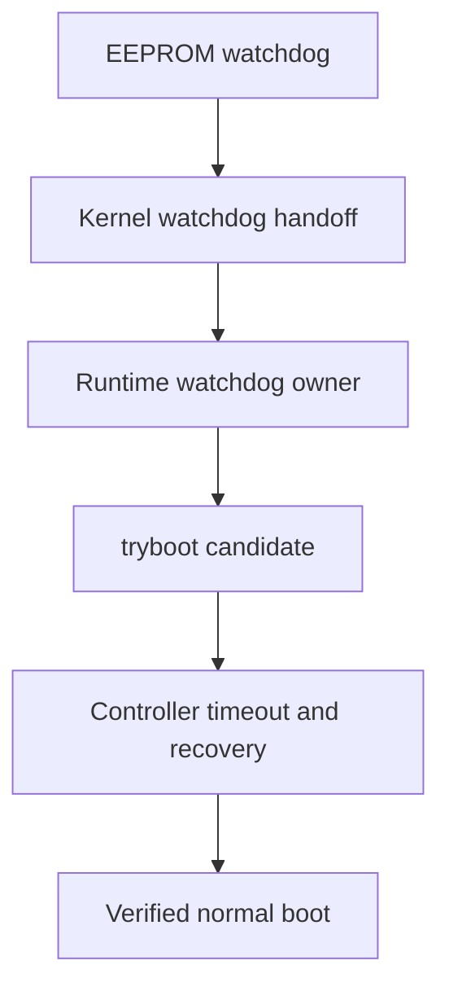

# AutoPiOverclock

**Recoverable, controller-driven Raspberry Pi 5 clock tuning over SSH.**

[](https://github.com/p1r473/AutoPiOverclock/actions/workflows/ci.yml)

## Quick start

> [!CAUTION]
> Overclocking can crash the target, corrupt storage, damage data, and in unusual cases contribute to hardware damage. `tryboot` and watchdogs reduce risk; they do not eliminate it. Back up the target and do not use this alpha on a system whose outage or corruption you cannot tolerate.

### 1. Install it on the controller Pi

Run AutoPiOverclock from a separate Linux controller, not from the Raspberry Pi being tuned. The controller and target must be different machines so a target crash or reboot cannot also remove the recovery observer.

Copy and paste this on the controller:

```bash
git clone https://github.com/p1r473/AutoPiOverclock.git
cd AutoPiOverclock
make test
sudo make install
autopioverclock --version
```

What those commands do:

- `git clone` downloads AutoPiOverclock and `cd` enters its directory.
- `make test` validates the local checkout. It does not connect to, modify, or reboot a target.
- `sudo make install` installs the program under `/usr/local` and creates `/usr/local/bin/autopioverclock`.
- `autopioverclock --version` confirms that the installed command works.

### 2. Prepare the target

Replace `pi-host` with the target's hostname, IP address, `username@hostname`, or `username@IP`:

```bash
autopioverclock prepare pi-host
```

`prepare` detects graphical or headless operation, installs and verifies required target-side dependencies, and proves watchdog recovery. The target must be a 64-bit ARM Raspberry Pi 5 with working SSH key authentication, adequate cooling, and a backup.

### 3. Overclock the target

```bash
autopioverclock overclock pi-host
```

This automatically searches CPU first, qualifies CPU and GPU separately, validates the selected pair, applies only a fully validated result, and verifies the final reboot. It takes many hours and safely continues its latest eligible run when the same command is repeated.

### 4. Reset to stock if you want to start over

```bash
autopioverclock reset pi-host
```

These are the only three commands needed for normal use: `prepare`, `overclock`, and `reset`. Every command names its target explicitly.

To include the optional final CPU +25 MHz edge test using its 24-hour default:

```bash
autopioverclock overclock pi-host --edge-hours 24
```

The default long tests are 2 hours for each CPU/GPU qualification, 8 hours for final combined validation, and 24 hours for the optional edge. To choose whole-hour durations explicitly:

```bash
autopioverclock overclock pi-host --qualification-hours 3 --final-hours 12 --edge-hours 36
```

Each value may be 1–168 hours. Omitting duration options keeps the recommended 2-hour qualifications and 8-hour final validation; edge testing remains optional and uses 24 hours when requested with the compatibility flag or `--edge-hours 24`. The selected durations are saved with the run and cannot change during continuation. A shorter custom plan can still complete and apply, but its status and report say `custom`; it does not provide the same confidence as the defaults. Use `test TARGET --minutes ...` when you need a sub-hour experiment for one exact clock pair.

### Updating an existing installation

Run this from the existing checkout on the controller:

```bash
cd AutoPiOverclock
git switch main
git pull --ff-only origin main
make test
sudo make install
autopioverclock --version
```

The same commands work on Raspberry Pi OS Lite and other supported screenless Debian-family targets. Auto mode selects `headless`, skips display/audio gates, finds the actual V3D render node instead of assuming a device number, and still runs CPU, GPU, storage, thermal, throttle, kernel, watchdog, and normal-recovery checks. If the GPU route is absent or ambiguous, `prepare` stops with evidence instead of silently performing CPU-only tuning.

If you already have exact clocks in mind and only want to stability-test them, use one bounded manual test:

```bash
autopioverclock test pi-host --cpu 3100 --gpu 1150 --minutes 90
```

`test` still uses owned `tryboot.txt`, the watchdog chain, maximum cooling, repeated candidate/normal boots, combined stress, health checks, protected-config hashing, and final normal recovery. The requested minutes cover the timed stress workload; safety boots and checks add wall time. A pass is retained as manual evidence only: it is not a conservative recommendation, does not satisfy an automatic run's saved validation plan, cannot be passed to `apply`, and never changes permanent clocks. Repeat the identical command to continue an interrupted current-schema manual test. Use `--no-max-fan` only when you intentionally want that test to use the target's ordinary or externally controlled cooling policy.

During an interactive run, the controller displays a live whole-workflow line similar to:

```text
pi-host [########------------] ~42% ETA ~6h12m | current 7m32s left | tests ~11 left | CPU: 3100MHz | GPU: 1150MHz | 64.2C max=65.0C | final endurance | throttled=0x0 | fan=pwm:255,rpm:5200
```

The whole-run percentage, ETA, and number of tests remaining are best-effort estimates and dynamically re-plan when a stability boundary adds refinement or removes higher candidates. The current timed-stress countdown comes from the worker's actual elapsed counter. Host, active clocks, current/run-maximum temperature, throttle state, and activity are shown when terminal width permits. Every repaint rechecks the current terminal width, explicitly replaces the existing row without a newline, and leaves the wrapping final column unused, including after a Byobu/tmux or mobile-terminal resize. `Ctrl-C` and other termination signals clear the line before normal recovery starts and suppress it while recovery logs are printed. Redirected/noninteractive output keeps ordinary line-by-line telemetry instead of terminal control characters, and all raw worker telemetry remains in the retained logs.

Maximum Pi PWM fan cooling is automatic during tuning and manual stability tests. Most users should leave it enabled. `--no-max-fan` is available for an externally controlled cooling system or when intentionally testing with the target's own fan curve.

> **Cooling is part of the test condition.** Reducing fan speed does not directly lower the configured clock, but the higher temperature can cause throttling, reduce sustained performance, or expose instability; if the Pi was never thermally limited, it may make little difference. Default results are maximum-cooling results. AutoPiOverclock restores the original fan curve after tuning, so that curve still needs enough capacity for the applied clocks. To validate against the everyday fan curve instead, use `--no-max-fan` from the beginning; cooling policy cannot change during resume.

Every operational command requires a target hostname, IP address, or `username@host`. AutoPiOverclock never guesses or remembers a target, so commands in different terminal tabs cannot be redirected to the wrong Pi. New SSH host keys are accepted on first use, but changed keys are refused.

`prepare` may install packages, stage the Batocera GPU payload, install or repair watchdog recovery, preserve verified backups, and reboot to prove the result. `overclock` can reboot or crash the target and takes many hours. It keeps candidate clocks in `tryboot.txt`, requests maximum Pi 5 PWM fan cooling by default, uses short search candidates, separately qualifies CPU and GPU for the saved qualification duration, validates the pair for the saved final duration under combined CPU/GPU/I/O load, displays and retains the exact permanent diff, then applies and verifies that result. The recommended defaults are 2-hour qualifications, an 8-hour final, and a 24-hour edge only when edge testing is requested. `test` exercises one explicit CPU/GPU pair for the requested minutes but deliberately stops short of validation or application. The maximum-fan override exists only in candidate tryboots. The protected permanent config—including every pre-existing custom fan line—is not rewritten for cooling, so each normal recovery and the eventual permanent result automatically return to the user's ordinary fan policy. `--no-max-fan` disables the temporary override for a new tuning/manual run while leaving the temperature and throttle gates active. `--edge-hours HOURS` adds a fresh combined CPU/GPU/I/O validation at CPU 25 MHz above the validated floor. It can be supplied on the original run or run later against the retained applied floor without repeating that completed final phase. `--edge-cpu-24h` remains a compatibility spelling for `--edge-hours 24`. `reset` is standalone and noninteractive; it backs up the boot config, removes permanent tuning, reboots, and verifies stock clocks while retaining every prior run artifact.

If `prepare` reports an existing unknown `tryboot.txt`, a dirty or ambiguous boot configuration, a foreign watchdog owner, an unhealthy target, or a missing controller-side Batocera bundle prerequisite, it stops without overwriting that evidence. Results are retained under `$HOME/overclock-results`.

AutoPiOverclock tests clock candidates through Raspberry Pi `tryboot`, proves that the target can recover normally after every candidate, and refuses to treat a short benchmark pass as a production recommendation. It is built for repeatability and recovery—not benchmark records.

## Why this exists

Typical overclock testing answers only one question: “Did this workload finish?” AutoPiOverclock also asks:

- Did the target actually boot through `tryboot`?
- Were the requested clocks really active under load?
- Did power, temperature, storage, USB, GPU, display, audio, services, and kernel health remain clean?
- Did every recovery boot return to the protected permanent normal configuration?
- Is the proposed production clock backed off from the maximum observed pass?
- Did the guarded CPU and GPU pass their saved qualification durations, and did the pair survive its saved combined CPU/GPU/I/O final duration?
- When requested, did CPU 25 MHz higher survive the saved combined CPU/GPU/I/O edge duration at the production-floor GPU?

The tool deliberately records distinct result concepts instead of collapsing every pass into one number:

| Result | Meaning |
| --- | --- |
| Maximum observed pass | Highest candidate that completed its candidate gates. |
| Guarded production target | Explicit-plan backoff, or the candidate-tested automatic CPU/GPU guard selected for ordinary final validation. |
| Validated production floor | Automatic guarded target after the saved final validation; preserved separately when optional edge testing is requested. |
| Optional CPU edge | Production-floor CPU plus 25 MHz, tested for the saved edge duration under combined CPU/GPU/I/O load; a safely rejected edge retains the validated floor, while a pass becomes the final CPU result. |
| Final validated clock | The completed ordinary floor or successful optional edge result recorded under the current validation schema. |

## Safety invariants

- Permanent `config.txt` is hashed and protected throughout testing.
- Each candidate `tryboot.txt` is rendered from the complete protected `config.txt` and adds only an owned clock/cooling block, so required GPU drivers, overlays, display, audio, PCIe, and other unrelated boot settings remain present. Candidate values are written only to that temporary file.
- By default, every candidate/final-validation tryboot sets the Pi 5 fan's first threshold to 0C and all four PWM levels to 255. A detected Linux `pwmfan` device must report PWM 255 and, when tachometer telemetry exists, nonzero RPM before and during load. A missing PWM device is reported honestly as `not-detected`; passive or externally controlled cooling still uses the strict temperature and throttle gates. `--no-max-fan` is an explicit new-run opt-out.
- `prepare` and `overclock` refuse to overwrite any pre-existing `tryboot.txt` or unknown recovery file.
- Every project-created `tryboot.txt` is bound to the current attempt by a fresh random ownership token and recorded SHA-256 evidence. Creation is no-clobber, trigger re-verifies the completed file, and cleanup quarantines then re-verifies it after a normal recovery before removal.
- Candidate clock values remain confined to `tryboot.txt`. Only the final fully validated result is written to permanent configuration at the end of `overclock`; `prepare` may change only required dependency and watchdog configuration.
- Every candidate includes repeated candidate boots, normal recoveries, stress, health checks, and a final normal boot.
- Every reboot completes a controller-side handshake: changed boot ID, fresh run-isolated worker deployment, and only then clock, tryboot, watchdog, or health verification. Debian's worker may live under volatile `/tmp` because it is deliberately re-uploaded after every reboot.
- Active EEPROM, kernel, runtime, and userspace-watchdog evidence is required before tuning.
- Historical sticky throttle bits are separated from current or newly observed failures.
- Failed, missing, late, or malformed evidence fails closed.
- Tryboot staging/trigger/cleanup, normal reboot, stock reset, watchdog repair, permanent apply, and rollback share one target-side atomic lock, so independent controllers cannot overlap boot-critical mutations.
- Existing run artifacts are retained; only `*-latest.*` links are updated.
- The simple `overclock` command applies only a fully validated current-schema result and retains the exact diff. The advanced standalone `apply` recovery command still demands a typed confirmation.



## Supported targets

“Supported” means the platform has an implemented, fixture-covered alpha path. It does not mean that every hardware/firmware combination has completed end-to-end qualification.

| Target | Status | Notes |
| --- | --- | --- |
| Raspberry Pi OS | Supported | 64-bit ARM Raspberry Pi boot layout. |
| Debian | Supported | 64-bit ARM; `/boot/firmware/config.txt` or `/boot/config.txt`. |
| Ubuntu | Supported | 64-bit ARM Raspberry Pi boot layout only. |
| Batocera | Supported | 64-bit ARM Buildroot; read-only `/boot` handling and graphical gates. |
| Arch Linux | Not supported | Outside the v1 scope. |
| Generic Linux distributions | Not supported | Detection is intentionally narrow. |

Batocera is treated as Buildroot, not Arch Linux. AutoPiOverclock never attempts an in-place glibc upgrade on Batocera.

## Current validation status

This repository is alpha software. Automated fixtures are not a substitute for Raspberry Pi hardware evidence, and the live CI badge above is the authoritative status for the current GitHub commit.

As of 2026-08-29, `alpha.31` keeps `prepare`, `overclock`, and `reset` as the complete normal interface while retaining the expert recovery engine underneath. Automatic tuning searches CPU first, qualifies CPU at stock GPU, then searches and qualifies GPU at that CPU before combined validation. The recommended defaults are 2-hour qualifications, an 8-hour final, and a 24-hour edge when the optional edge is requested; explicit whole-hour overrides are saved immutably, drive resume/ETA/apply checks, and are labeled custom. Eligible recovered boot/stability failures back off and continue automatically, and unattended `overclock` keeps monitoring through extended SSH loss without repeatedly rebooting the target. Raspberry Pi OS/Debian headless operation is automatic and does not require display or audio hardware. Debian-family and Batocera runs still require completed current-schema artifact review, so this README intentionally makes no hardware-pass or production-clock claim from the UX release.

| Evidence | Current status |
| --- | --- |
| Bash fixture suite | 19 scripted suites cover the three-command/manual-test interface, progress calculations/rendering, installed entry point, state, classification, workers, tryboot, watchdog installation, selection, resume, apply, reset, packaging, and public-safety contracts. |
| GitHub CI and ShellCheck | See the live badge for the current commit. |
| Debian-family Raspberry Pi 5 run | Autonomous stress recovery has been observed, but a complete `alpha.31` run remains pending. |
| Batocera Raspberry Pi 5 run | Recovery-mode boot and watchdog preparation have been exercised, but complete `alpha.31` validation remains pending. |
| Default eight-hour production-floor validation | No public PASS claim until the retained run artifacts complete and are reviewed. |
| Default optional 24-hour CPU edge validation | No public PASS claim until the production floor passes first and the edge artifacts are reviewed. |

Do not infer a production recommendation from a candidate pass, an active run, or this table. Only a run that reaches `COMPLETE`, records `Validated: 1` under the current validation schema, and finishes `overclock` with `APPLY_STATUS=APPLIED` is installed by the normal workflow. The standalone expert `apply` command retains its separate confirmation.

## Requirements

- Two separate machines: one Linux controller (another Raspberry Pi is fine) and one 64-bit Raspberry Pi 5 target. The target must not overclock itself; the separate controller must remain alive to observe crashes, reconnect after reboots, and prove recovery.
- Bash 4.3 or newer.
- `git` and GNU Make for the clone-and-test commands shown below; `tar`, `zip`, and `unzip` for the packaging fixture.
- Noninteractive SSH key authentication.
- `sudo -n` on a non-root Debian-family target, or an explicitly supplied root target where appropriate.
- Local `ssh`, `awk`, `sed`, `grep`, `date`, `mktemp`, `sha256sum`, `base64`, `diff`, `cmp`, `flock`, `od`, `tr`, and `sync`.
- A Debian-family controller with `apt-get`, `dpkg-deb`, and `tar` when `prepare` must build the Batocera ARM64 glmark2 payload locally.
- Remote `/bin/bash`.
- A 64-bit ARM (`aarch64`/`arm64`) Raspberry Pi 5 target with tested power, cooling, backups, and a working normal boot.

SSH key authentication must already work without a password prompt. A new host key is accepted on first use and a changed key is rejected. If `user@` is omitted, the controller's current `id -un` value becomes the SSH username; the tool never silently assumes `pi` or `root`.

Connect to the target and prove key-only SSH before using AutoPiOverclock:

```bash
# Replace this with the target's real SSH destination.
TARGET=user@target-host

# Review and accept the host key, then separately prove key-only SSH.
ssh "$TARGET" true
ssh -o BatchMode=yes "$TARGET" true
```

## How automatic overclocking works

The normal `autopioverclock overclock TARGET` strategy is deliberately ordered so a GPU result is never used to guess a CPU boundary, and vice versa:

1. **Prove the stock baseline and recovery path.** The controller verifies the protected permanent config, stock clocks, watchdog chain, normal boot, and owned `tryboot` lifecycle before searching.
2. **Search CPU first.** CPU rises from 2500 to 3200 MHz in 100 MHz steps with 10-minute candidates. A real boot/stability boundary is refined in 25 MHz steps.
3. **Back off and qualify CPU.** The selected CPU is candidate-tested 50 MHz below the boundary or ceiling, then qualified with GPU held at stock. The default is 2 hours; `--qualification-hours HOURS` changes both domain qualifications.
4. **Search and qualify GPU.** Only after CPU qualification passes does V3D/GPU rise in 50 MHz steps through 1200 MHz, refine a real boundary in 25 MHz steps, and test its 25 MHz guard. That GPU is then qualified at the already-qualified CPU for the same saved qualification duration.
5. **Validate the pair.** The exact guarded pair runs combined CPU/GPU/I/O load for 8 hours by default, or for `--final-hours HOURS` when explicitly selected, followed by repeated candidate/normal boot cycles and protected-config verification.
6. **Recover and back off automatically.** A proved CPU-qualification failure lowers CPU by 50 MHz; a proved GPU-qualification failure lowers GPU by 25 MHz. A combined-final failure cannot identify one domain, so every still-overclocked domain is lowered by its guard and both qualifications are repeated. Harness or recovery uncertainty stops rather than being mislabeled as a clock boundary.
7. **Optionally test the CPU edge.** `--edge-hours HOURS` tests CPU exactly 25 MHz above the validated floor under combined CPU/GPU/I/O load. The recommended edge duration is 24 hours: use `--edge-hours 24` or the compatibility spelling `--edge-cpu-24h`. It can also be started later from the retained applied floor without repeating the completed final phase.
8. **Apply only completed evidence.** The exact permanent diff is retained and shown, then the validated result is applied, rebooted, and re-proved. Maximum PWM fan cooling is temporary during candidate boots; the user's original fan policy returns on normal boots and after application.

The recommended public policy is 2 hours for each qualification, 8 hours for final validation, and 24 hours if the optional edge is enabled. Custom whole-hour values from 1–168 are explicit test conditions: they are stored immutably, drive the progress ETA and apply gate, and appear as `custom` in status/report. Shortening them trades confidence for time; it does not make the workload stronger.

## First hardware run

Prepare the target once:

```bash
autopioverclock prepare pi-host
```

`prepare` discovers the Raspberry Pi 5 and its boot layout, chooses graphical validation when a healthy screen/session exists and headless validation when no screen is present, installs missing stress dependencies, installs or repairs the recovery watchdog when required, reboots when activation needs it, and finishes only after the active watchdog chain and normal stock baseline are proved. On headless Raspberry Pi OS/Debian, display and audio are intentionally not prerequisites; the worker discovers the V3D render node dynamically and verifies that `stress-ng` can drive it, including a safe single-node fallback for older packages without `--gpu-devnode`. A physically present but unhealthy display is not silently treated as headless. Debian graphical discovery automatically uses the active PipeWire/PulseAudio sink when available and otherwise binds validation to every detected ALSA playback device; no manual sink setting is needed. On Batocera it preserves existing services and any already-positive EEPROM boot-watchdog timeout, installs a project-owned keeper only when needed, requires the single current IPv4 default gateway to answer before binding network-loss detection to it, waits three minutes before judging startup connectivity, and stops rebooting after three consecutive recovery attempts within 30 minutes.

Configuration-free automatic tuning requires the firmware-stock tuple: CPU 2400 MHz, V3D 800 or 960 MHz, and zero voltage delta, with no explicit clock/voltage override or unbound `include`. Preparation still installs and proves prerequisites on a currently tuned host; it then tells you to reset once before overclocking:

```bash
autopioverclock reset pi-host
autopioverclock overclock pi-host
```

Then start the full run:

```bash
autopioverclock overclock pi-host
```

With no duration options, the strategy above uses two-hour CPU/GPU qualifications and eight hours of combined CPU/GPU/I/O final validation. The command retains and displays the permanent-config diff, applies only the result that completes its exact saved plan, reboots, and proves it.

To add the optional final edge test:

```bash
autopioverclock overclock pi-host --edge-hours 24
```

On a fresh run, that first validates the guarded floor, then tests CPU exactly 25 MHz higher for the selected edge duration with the qualified production-floor GPU and combined CPU/GPU/I/O load. If the final result was already completed and applied without an edge, run the same command later: AutoPiOverclock links a new edge record to that retained floor, re-proves its live hash/health/tryboot state, and begins the edge validation directly. It does not repeat the completed final phase. The later edge run retains the source run's graphical or headless mode and uses a separate apply/rollback backup. It uses maximum fan cooling unless that new edge invocation explicitly includes `--no-max-fan`. A safely recovered edge boot/stability failure keeps the already-applied floor; harness or recovery uncertainty still stops the run.

The controller preserves the internal recovery proof, token/hash-owned `tryboot.txt` lifecycle, candidate/normal boot cycles, GPU harness, telemetry, artifacts, immutable durations, and resumable state. Rerunning `autopioverclock overclock pi-host` continues its own latest safely resumable run and completes application. Ordinary users do not have to assemble a chain of `run`, dependency, watchdog, `resume`, and `apply` commands.

## Commands

| Command | Purpose |
| --- | --- |
| `prepare TARGET` | Install and verify dependencies and watchdog recovery. Add `--dry-run` for read-only discovery and plan generation. |
| `overclock TARGET` | Automatically tune, validate, apply, reboot, and verify the target. |
| `test TARGET` | Test one exact `--cpu`/`--gpu` pair for `--minutes`; recover normally and retain evidence without applying it. |
| `reset TARGET` | Back up the boot config, remove tuning, reboot, and verify stock clocks. |
| `run TARGET` | Use the advanced prepare, recovery-proof, sweep, selection, and validation interface. |
| `resume TARGET` | Recover when necessary and continue saved progress. |
| `status TARGET` | Show local state for the selected or latest run; supports redaction. |
| `recover TARGET` | Return the target to permanent normal configuration and verify health. |
| `apply TARGET` | Apply only a fully validated result after an exact diff and typed confirmation. |
| `report TARGET` | Generate a concise run report; supports redaction. |

`--qualification-hours`, `--final-hours`, and `--edge-hours` customize the three long automatic gates; `--edge-hours` also enables the optional edge. `--edge-cpu-24h` remains compatible with older instructions. Maximum cooling is the default; `--no-max-fan` opts a new tuning or manual-test run out while preserving every normal thermal/throttle gate. Transport/output options and the retained expert recovery/reporting interface are documented in [`docs/cli.md`](docs/cli.md); they are not part of the normal three-command workflow.

## Configuration

Configuration files are strict, data-only `KEY=VALUE` files. They are parsed, never sourced.

```ini
cpu_candidates_mhz=
gpu_candidates_mhz=
voltage_delta_uv=existing
candidate_duration_seconds=600
final_duration_seconds=28800
max_temp_c=75
telemetry_interval_seconds=5
conservative_backoff_steps=1
candidate_boots=2
final_boots=3
required_services=
frontend_process=
audio_sink_pattern=
```

Custom configuration is an advanced `run TARGET --config FILE` interface retained for development and support. The normal `autopioverclock overclock TARGET` command intentionally uses the fixed automatic policy above and accepts no custom clock plan. Explicit candidate lists must be strictly increasing; empty lists skip that domain, and at least one domain must contain candidates.

`voltage_delta_uv=existing` preserves the target's existing value; AutoPiOverclock never silently raises voltage. `final_duration_seconds` accepts 3,600–604,800 seconds for the advanced explicit plan, candidate boots cannot be lower than two, and final boot/recovery cycles cannot be lower than three. The simple hour options are preferred for automatic tuning because they bind qualification, final, and edge timing visibly in one command.

| Key | Meaning and accepted values |
| --- | --- |
| `cpu_candidates_mhz` | Strictly increasing comma-separated CPU clocks; each value 600–4000 MHz. Empty skips CPU tuning. |
| `gpu_candidates_mhz` | Strictly increasing comma-separated V3D clocks; each value 200–3000 MHz. Empty skips GPU tuning. |
| `voltage_delta_uv` | `existing`, or an explicit 0–100000 microvolt delta. |
| `candidate_duration_seconds` | Stress duration for each short search candidate; 10–86400 seconds. |
| `final_duration_seconds` | Combined endurance duration for an advanced explicit plan; 3600–604800 seconds. |
| `max_temp_c` | Exclusive temperature ceiling; 40–95 °C. Reaching the ceiling fails the candidate. |
| `telemetry_interval_seconds` | Temperature, clocks, throttle, and kernel-error sampling cadence; 1–60 seconds. Workload supervision still runs every second. |
| `conservative_backoff_steps` | Explicit-plan positions to step down from the maximum observed pass; 0–10. Configuration-free auto uses its fixed MHz guards instead. |
| `candidate_boots` | Candidate/normal recovery cycles before candidate stress; 2–10. |
| `final_boots` | Post-endurance candidate/normal recovery cycles; 3–10. |
| `required_services` | Optional comma-separated service names that must remain active. |
| `frontend_process` | Optional single process name that must remain present. |
| `audio_sink_pattern` | Optional literal substring required in the default audio-sink inspection. |

## What every candidate must prove

- SSH returns after the expected boot.
- The firmware reports an active `tryboot` candidate.
- Requested clocks are observed under load within tolerance.
- With the default cooling policy, any detected Pi 5 PWM fan remains at setting 255 (100%) with a live tachometer when exposed; losing that test condition aborts without being labeled a CPU/GPU boundary. `--no-max-fan` uses the target's ordinary policy and does not claim or require PWM 255.
- Current/new throttle and undervoltage evidence remains clean.
- Temperature remains below the configured ceiling.
- No new filesystem, storage, USB-reset, GPU, kernel panic/internal error/Oops, RCU-stall, hung-task, or watchdog fault appears.
- The stress process exits successfully and within its hard deadline.
- Graphical runs always preserve the captured display and audio baselines. Debian automatically prefers the active PipeWire/PulseAudio sink and falls back to the complete ALSA playback-device inventory without guessing one output; Batocera requires its active default sink. `audio_sink_pattern` remains an optional additional expert constraint.
- Required services and processes remain healthy.
- Permanent configuration retains its original SHA-256 hash.
- The following recovery boot clears `tryboot` and passes normal health checks.

GPU harness failures are kept separate from clock-stability failures. A required graphical or headless backend that cannot launch, bind the hardware V3D renderer, complete with its required success evidence, or preserve any applicable display/audio baseline is a `HARNESS_FAILURE`, not proof that the tested GPU clock is unstable. A positive score is required when glmark2 is the selected workload. Batocera graphical testing uses an off-screen Wayland workload on the live EmulationStation compositor; it does not take DRM master or stop and restore the frontend.

Stress timing is fail-closed. Batocera CPU load uses exactly one 16 KiB SHA-256 benchmark measured in elapsed time, so the requested duration is the total workload duration rather than a per-buffer-size duration. Workloads retain a separate 60-second shutdown deadline after their requested duration, and controller SSH/reboot budgets include wall time spent inside connection attempts instead of silently stretching a nominal recovery timeout.

## Recovery and resume

Each candidate and final-validation substage is checkpointed atomically. The random ownership token, completed-file hash, reservation hash, token-specific quarantine path, and cooling policy are saved before remote creation can begin. If the controller exits while `tryboot` may be active, its exit trap attempts normal recovery. `resume` repeats recovery first whenever saved or live evidence says the target may still be in `tryboot`, verifies normal recovery, and cleans only token/hash-matching project evidence; an unknown or changed path is preserved and fails closed. A resumed run keeps its saved cooling policy rather than changing test conditions halfway through.

An SSH timeout alone remains `HARNESS_FAILURE`. During an active stress stage, it becomes `STABILITY_FAILURE` only when recovery proves that the exact saved candidate boot ID already changed to a clear normal boot before the controller requested any reboot. This captures a proven autonomous candidate reboot without assigning an unverified cause or turning a same-boot network interruption into false silicon evidence; any failed normal recovery remains `RECOVERY_FAILURE`. The normal public `overclock TARGET` command does not exit merely because the ordinary SSH budget expires: it continues read-only polling, issues no second reboot, and reconciles the boot automatically when SSH returns. `Ctrl-C` leaves the saved run resumable. After every expected or observed reboot, the controller re-uploads the run-isolated worker before it asks that worker for health evidence, so volatile `/tmp` cleanup is handled automatically.

```bash
autopioverclock status target-host --run-id RUN_ID
autopioverclock report target-host --run-id RUN_ID
autopioverclock resume target-host --run-id RUN_ID
autopioverclock recover target-host --run-id RUN_ID
```

These are expert support commands, not normal setup steps. Use an explicit run ID whenever more than one retained run exists; a reset audit also advances the target's `*-latest` links. Evidence tied to an interrupted candidate boot is repeated when it cannot be preserved safely, and an older safety schema cannot bypass newer gates.

### Reset a target to verified stock defaults

Reset is command-first:

```bash
autopioverclock reset target-host
```

No postfix reset spelling is accepted. Reset is noninteractive, so it neither needs nor accepts `--yes`. It also rejects run-selection, tuning, dependency, watchdog, dry-run, edge-validation, fan-policy, mode, and redaction flags; only transport/output selectors may accompany it.

Before changing the permanent root boot config, reset requires a regular non-symlink config, a stable expected hash, no active `include` directive, and no foreign or ambiguous `tryboot.txt`/quarantine path. It writes a hash-verified, no-clobber backup under `/var/lib/autopioverclock/backups/` on Debian-family systems or `/userdata/system/autopioverclock/backups/` on Batocera. Standalone boost, fixed-clock, `*_freq`/`*_freq_min`, and `over_voltage*` lines are retained as comments prefixed with `# AUTOPIOVERCLOCK-STOCK-DISABLED`; the clock directives and markers in one structurally valid AutoPiOverclock managed block are removed while its `[all]` section boundary is retained, with the complete original bytes in the verified backup. An attributable AutoPiOverclock tryboot artifact is backed up before removal, while unknown paths are preserved and reset fails closed. If the running firmware reports a tryboot boot but no live or quarantined path exists, reset does not claim ownership of that boot; it safely prepares the backed-up permanent stock config, forces a normal reboot, and requires the post-reboot tryboot flag to be clear. Batocera must also restore and verify `/boot` read-only.

Reset then forces a permanent-config reboot and accepts success only after a new boot ID, an exact expected config hash, an absent/cleared tryboot state, and active Raspberry Pi 5 stock clocks are all verified: CPU 2400 MHz, firmware-default V3D 800 or 960 MHz, and zero voltage delta. The same verification checks current throttle/power state and the active watchdog chain; reset does not claim the broader display, audio, service, or workload health gates used by tuning. A reset creates its own audit state/log and reports the remote backup path; it never deletes or truncates prior logs, state, summaries, candidate logs, or saved runs.

Reset does not run `tmux`, Byobu, job-control, or process-wide kill commands. If another controller still owns the per-target lock, reset fails without signaling that process or its terminal session; stop that one foreground controller yourself and repeat `autopioverclock reset TARGET`.

## Results

All targets and runs share one flat output directory, `$HOME/overclock-results` by default. There are no per-host subdirectories, and prior runs are never deleted. A typical tuning run creates the following artifacts; a standalone reset creates its own audit state/log/summary/CSV/JSON but intentionally does not manufacture a tuning `.conf` or candidate logs.

```text
target-20260823-010000-a1b2c3d4e5f60708.log
target-20260823-010000-a1b2c3d4e5f60708.csv
target-20260823-010000-a1b2c3d4e5f60708.json
target-20260823-010000-a1b2c3d4e5f60708.state
target-20260823-010000-a1b2c3d4e5f60708.conf
target-20260823-010000-a1b2c3d4e5f60708.jsonl
target-20260823-010000-a1b2c3d4e5f60708-discovery.txt
target-20260823-010000-a1b2c3d4e5f60708-summary.txt
target-20260823-010000-a1b2c3d4e5f60708-cpu-CLOCK_gpu-CLOCK-candidate.log
target-latest.log
target-latest-summary.txt
target-latest.state
target-latest.json
```

See [`docs/output.md`](docs/output.md) for artifact fields and failure classifications.

## Applying a validated result

`autopioverclock overclock TARGET` includes application: candidate clocks remain isolated in `tryboot.txt`; after the guarded result completes the current validation schema and the exact immutable saved duration plan, the same command displays and retains the permanent diff, writes the validated clocks, reboots, and proves the result. A failed, incomplete, or duration-mismatched validation is never applied. Status and reports distinguish the recommended default policy from an explicitly shortened or lengthened custom policy.

The standalone `apply TARGET --run-id RUN_ID` command remains available only for expert recovery of a previously completed, unapplied fully validated run. It retains the separate typed confirmation and cannot apply a reset audit, manual `test` result, or stale validation schema.

## Repository layout

```text
autopioverclock       command dispatcher
lib/                  controller libraries
profiles/             supported target profiles
workers/              target-side workers
assets/               packaged target-side watchdog assets
tests/                fixture and safety tests
examples/             approved configuration examples
tools/                packaging and Batocera bundle tooling
docs/                 design, safety, CLI, output, and platform notes
```

## Development

```bash
make test
make lint
make package
```

`make lint` requires ShellCheck. Changes to public commands, options, or the configuration schema require project-owner approval before implementation. Every new failure signature should include a fixture.

## License and security

AutoPiOverclock is licensed under the [Apache License 2.0](LICENSE). See [`CONTRIBUTING.md`](CONTRIBUTING.md) before submitting changes.

Do not post hostnames, addresses, SSH configuration, service names, logs, credentials, or unredacted run data in public issues. Follow [`SECURITY.md`](SECURITY.md) for private vulnerability reporting.
