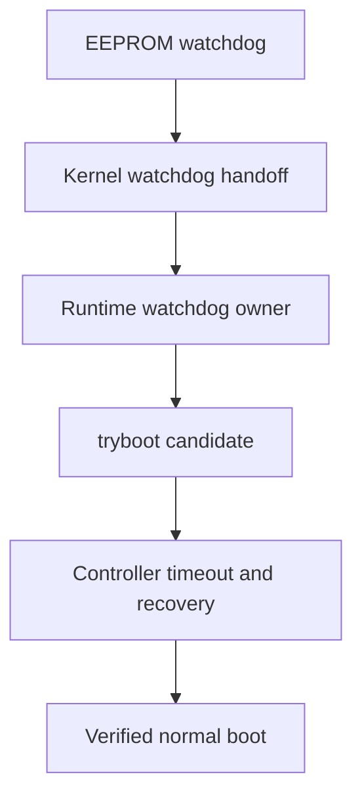

# AutoPiOverclock

**Recoverable, controller-driven Raspberry Pi 5 clock tuning over SSH.**

[](https://github.com/p1r473/AutoPiOverclock/actions/workflows/ci.yml)

## TL;DR — get started

> [!CAUTION]
> Overclocking can crash the target, corrupt storage, damage data, and in unusual cases contribute to hardware damage. `tryboot` and watchdogs reduce risk; they do not eliminate it. Back up the target and do not use this alpha on a system whose outage or corruption you cannot tolerate.

Run AutoPiOverclock from a separate Linux controller. The target must be a 64-bit ARM Raspberry Pi 5 with working SSH key authentication, adequate cooling, and a backup. `prepare` installs and proves the target-side prerequisites and recovery watchdog.

For a new checkout:

```bash
git clone https://github.com/p1r473/AutoPiOverclock.git
cd AutoPiOverclock
make test
sudo make install
autopioverclock --version
```

For an existing checkout:

```bash
cd AutoPiOverclock
git switch main
git pull --ff-only origin main
make test
sudo make install
autopioverclock --version
```

Then use the three-command workflow:

```bash
# 1. Install and verify dependencies and watchdog recovery.
autopioverclock prepare pi-host

# 2. Automatically tune, validate, and apply the safe result.
autopioverclock overclock pi-host

# 3. Return to verified stock clocks whenever needed.
autopioverclock reset pi-host
```

That is the normal interface. The optional final CPU +25 MHz test is the only tuning switch most users need:

```bash
autopioverclock overclock pi-host --edge-cpu-24h
```

Every operational command requires a target hostname, IP address, or `username@host`. AutoPiOverclock never guesses or remembers a target, so commands in different terminal tabs cannot be redirected to the wrong Pi. New SSH host keys are accepted on first use, but changed keys are refused.

`prepare` may install packages, stage the Batocera GPU payload, install or repair watchdog recovery, preserve verified backups, and reboot to prove the result. `overclock` can reboot or crash the target and takes many hours; it keeps candidate clocks in `tryboot.txt`, validates a guarded result for eight hours, displays and retains the exact permanent diff, then applies and verifies that result. `--edge-cpu-24h` adds a fresh 24-hour validation at CPU 25 MHz above the validated floor. `reset` is standalone and noninteractive; it backs up the boot config, removes permanent tuning, reboots, and verifies stock clocks while retaining every prior run artifact.

If `prepare` reports an existing unknown `tryboot.txt`, a dirty or ambiguous boot configuration, a foreign watchdog owner, an unhealthy target, or a missing controller-side Batocera bundle prerequisite, it stops without overwriting that evidence. Results are retained under `$HOME/overclock-results`.

AutoPiOverclock tests clock candidates through Raspberry Pi `tryboot`, proves that the target can recover normally after every candidate, and refuses to treat a short benchmark pass as a production recommendation. It is built for repeatability and recovery—not benchmark records.

## Why this exists

Typical overclock testing answers only one question: “Did this workload finish?” AutoPiOverclock also asks:

- Did the target actually boot through `tryboot`?
- Were the requested clocks really active under load?
- Did power, temperature, storage, USB, GPU, display, audio, services, and kernel health remain clean?
- Did every recovery boot return to the protected permanent normal configuration?
- Is the proposed production clock backed off from the maximum observed pass?
- Did the final clocks survive a separate eight-hour validation—and, when requested, did CPU 25 MHz higher survive a fresh 24-hour edge validation?

The tool deliberately records distinct result concepts instead of collapsing every pass into one number:

| Result | Meaning |
| --- | --- |
| Maximum observed pass | Highest candidate that completed its candidate gates. |
| Guarded production target | Explicit-plan backoff, or the candidate-tested automatic CPU/GPU guard selected for ordinary final validation. |
| Validated production floor | Automatic guarded target after the ordinary eight-hour validation; preserved separately when optional edge testing is requested. |
| Optional CPU edge | Production-floor CPU plus 25 MHz, tested for 24 hours; a safely rejected edge retains the validated floor, while a pass becomes the final CPU result. |
| Final validated clock | The completed ordinary floor or successful optional edge result recorded under the current validation schema. |

## Safety invariants

- Permanent `config.txt` is hashed and protected throughout testing.
- Candidate values are written only to `tryboot.txt`.
- `prepare` and `overclock` refuse to overwrite any pre-existing `tryboot.txt` or unknown recovery file.
- Every project-created `tryboot.txt` is bound to the current attempt by a fresh random ownership token and recorded SHA-256 evidence. Creation is no-clobber, trigger re-verifies the completed file, and cleanup quarantines then re-verifies it after a normal recovery before removal.
- Candidate clock values remain confined to `tryboot.txt`. Only the final fully validated result is written to permanent configuration at the end of `overclock`; `prepare` may change only required dependency and watchdog configuration.
- Every candidate includes repeated candidate boots, normal recoveries, stress, health checks, and a final normal boot.
- Active EEPROM, kernel, runtime, and userspace-watchdog evidence is required before tuning.
- Historical sticky throttle bits are separated from current or newly observed failures.
- Failed, missing, late, or malformed evidence fails closed.
- Tryboot staging/trigger/cleanup, normal reboot, stock reset, watchdog repair, permanent apply, and rollback share one target-side atomic lock, so independent controllers cannot overlap boot-critical mutations.
- Existing run artifacts are retained; only `*-latest.*` links are updated.
- The simple `overclock` command applies only a fully validated current-schema result and retains the exact diff. The advanced standalone `apply` recovery command still demands a typed confirmation.



## Supported targets

“Supported” means the platform has an implemented, fixture-covered alpha path. It does not mean that every hardware/firmware combination has completed end-to-end qualification.

| Target | Status | Notes |
| --- | --- | --- |
| Raspberry Pi OS | Supported | 64-bit ARM Raspberry Pi boot layout. |
| Debian | Supported | 64-bit ARM; `/boot/firmware/config.txt` or `/boot/config.txt`. |
| Ubuntu | Supported | 64-bit ARM Raspberry Pi boot layout only. |
| Batocera | Supported | 64-bit ARM Buildroot; read-only `/boot` handling and graphical gates. |
| Arch Linux | Not supported | Outside the v1 scope. |
| Generic Linux distributions | Not supported | Detection is intentionally narrow. |

Batocera is treated as Buildroot, not Arch Linux. AutoPiOverclock never attempts an in-place glibc upgrade on Batocera.

## Current validation status

This repository is alpha software. Automated fixtures are not a substitute for Raspberry Pi hardware evidence, and the live CI badge above is the authoritative status for the current GitHub commit.

As of 2026-08-27, `alpha.18` makes `prepare`, `overclock`, and `reset` the complete normal interface while retaining the existing fail-closed recovery engine underneath. Earlier Debian-family and Batocera runs still require completed current-schema artifact review, so this README intentionally makes no hardware-pass or production-clock claim from the UX release.

| Evidence | Current status |
| --- | --- |
| Bash fixture suite | 17 scripted suites cover the three-command interface, installed entry point, state, classification, workers, tryboot, watchdog installation, selection, resume, apply, reset, packaging, and public-safety contracts. |
| GitHub CI and ShellCheck | See the live badge for the current commit. |
| Debian-family Raspberry Pi 5 run | Earlier autonomous normal recovery at the 3200 MHz candidate succeeded; a complete `alpha.18` run remains pending. |
| Batocera Raspberry Pi 5 run | Recovery-mode boot returned, but a complete `alpha.18` run remains pending. |
| Eight-hour production-floor validation | No public PASS claim until the retained run artifacts complete and are reviewed. |
| Optional 24-hour CPU edge validation | No public PASS claim until the production floor passes first and the edge artifacts are reviewed. |

Do not infer a production recommendation from a candidate pass, an active run, or this table. Only a run that reaches `COMPLETE`, records `Validated: 1` under the current validation schema, and finishes `overclock` with `APPLY_STATUS=APPLIED` is installed by the normal workflow. The standalone expert `apply` command retains its separate confirmation.

## Controller prerequisites

- Bash 4.3 or newer.
- `git` and GNU Make for the clone-and-test commands shown below; `tar`, `zip`, and `unzip` for the packaging fixture.
- Noninteractive SSH key authentication.
- `sudo -n` on a non-root Debian-family target, or an explicitly supplied root target where appropriate.
- Local `ssh`, `awk`, `sed`, `grep`, `date`, `mktemp`, `sha256sum`, `base64`, `diff`, `cmp`, `flock`, `od`, `tr`, and `sync`.
- A Debian-family controller with `apt-get`, `dpkg-deb`, and `tar` when `prepare` must build the Batocera ARM64 glmark2 payload locally.
- Remote `/bin/bash`.
- A 64-bit ARM (`aarch64`/`arm64`) Raspberry Pi 5 target with tested power, cooling, backups, and a working normal boot.

AutoPiOverclock runs `command ssh -F /dev/null`; user SSH aliases and wrappers are intentionally bypassed. SSH key authentication must already work without a password prompt. A new host key is accepted on first use and a changed key is rejected. If `user@` is omitted, the controller's current `id -un` value becomes the SSH username; the tool never silently assumes `pi` or `root`.

## First hardware run

Prepare the target once:

```bash
autopioverclock prepare pi-host
```

`prepare` discovers the Raspberry Pi 5 and its boot layout, chooses graphical or headless validation, installs missing stress dependencies, installs or repairs the recovery watchdog when required, reboots when activation needs it, and finishes only after the active watchdog chain and normal stock baseline are proved. On Batocera it preserves existing services, installs a project-owned keeper only when needed, requires the single current IPv4 default gateway to answer before binding network-loss detection to it, waits three minutes before judging startup connectivity, and stops rebooting after three consecutive recovery attempts within 30 minutes.

Configuration-free automatic tuning requires the firmware-stock tuple: CPU 2400 MHz, V3D 800 or 960 MHz, and zero voltage delta, with no explicit clock/voltage override or unbound `include`. Preparation still installs and proves prerequisites on a currently tuned host; it then tells you to reset once before overclocking:

```bash
autopioverclock reset pi-host
autopioverclock overclock pi-host
```

Then start the full run:

```bash
autopioverclock overclock pi-host
```

CPU candidates climb from 2500 through 3200 MHz in 100 MHz steps. V3D climbs in 50 MHz steps through 1200 MHz from the detected 800 or 960 MHz firmware default. A real boot/stability boundary is refined in 25 MHz steps. The guarded result is candidate-tested 50 MHz below the CPU boundary and 25 MHz below the GPU boundary, then validated for eight hours. The command retains and displays the exact permanent-config diff, applies only that fully validated result, reboots, and proves it.

To add the optional final edge test:

```bash
autopioverclock overclock pi-host --edge-cpu-24h
```

That first validates the ordinary guarded floor, then tests CPU exactly 25 MHz higher through a separate 24-hour validation. A safely recovered edge boot/stability failure keeps and applies the already-validated floor; harness or recovery uncertainty still stops the run.

The controller preserves the internal recovery proof, token/hash-owned `tryboot.txt` lifecycle, candidate/normal boot cycles, GPU harness, telemetry, artifacts, and resumable state. Rerunning `autopioverclock overclock pi-host` continues its own latest safely resumable current-version run and completes application; failed or ambiguous evidence still stops. Ordinary users do not have to assemble a chain of `run`, dependency, watchdog, `resume`, and `apply` commands.

## Commands

| Command | Purpose |
| --- | --- |
| `prepare TARGET` | Install and verify dependencies and watchdog recovery. Add `--dry-run` for read-only discovery and plan generation. |
| `overclock TARGET` | Automatically tune, validate, apply, reboot, and verify the target. |
| `reset TARGET` | Back up the boot config, remove tuning, reboot, and verify stock clocks. |
| `run TARGET` | Use the advanced prepare, recovery-proof, sweep, selection, and validation interface. |
| `resume TARGET` | Recover when necessary and continue saved progress. |
| `status TARGET` | Show local state for the selected or latest run; supports redaction. |
| `recover TARGET` | Return the target to permanent normal configuration and verify health. |
| `apply TARGET` | Apply only a fully validated result after an exact diff and typed confirmation. |
| `report TARGET` | Generate a concise run report; supports redaction. |
| `TARGET reset` | Historical postfix spelling retained for compatibility. |

`--edge-cpu-24h` is the optional final CPU edge test. Transport/output options and the retained expert recovery/reporting interface are documented in [`docs/cli.md`](docs/cli.md); they are not part of the normal three-command workflow.

## Configuration

Configuration files are strict, data-only `KEY=VALUE` files. They are parsed, never sourced.

```ini
cpu_candidates_mhz=
gpu_candidates_mhz=
voltage_delta_uv=existing
candidate_duration_seconds=600
final_duration_seconds=28800
max_temp_c=75
telemetry_interval_seconds=5
conservative_backoff_steps=1
candidate_boots=2
final_boots=3
required_services=
frontend_process=
audio_sink_pattern=
```

Custom configuration is an advanced `run TARGET --config FILE` interface retained for development and support. The normal `autopioverclock overclock TARGET` command intentionally uses the fixed automatic policy above and accepts no custom clock plan. Explicit candidate lists must be strictly increasing; empty lists skip that domain, and at least one domain must contain candidates.

`voltage_delta_uv=existing` preserves the target's existing value; AutoPiOverclock never silently raises voltage. `final_duration_seconds` cannot be shorter than 28,800 seconds, candidate boots cannot be lower than two, and final boot/recovery cycles cannot be lower than three.

| Key | Meaning and accepted values |
| --- | --- |
| `cpu_candidates_mhz` | Strictly increasing comma-separated CPU clocks; each value 600–4000 MHz. Empty skips CPU tuning. |
| `gpu_candidates_mhz` | Strictly increasing comma-separated V3D clocks; each value 200–3000 MHz. Empty skips GPU tuning. |
| `voltage_delta_uv` | `existing`, or an explicit 0–100000 microvolt delta. |
| `candidate_duration_seconds` | Stress duration for each candidate and each final CPU/GPU-only gate; 10–86400 seconds. |
| `final_duration_seconds` | Combined endurance duration; 28800–604800 seconds. |
| `max_temp_c` | Exclusive temperature ceiling; 40–95 °C. Reaching the ceiling fails the candidate. |
| `telemetry_interval_seconds` | Temperature, clocks, throttle, and kernel-error sampling cadence; 1–60 seconds. Workload supervision still runs every second. |
| `conservative_backoff_steps` | Explicit-plan positions to step down from the maximum observed pass; 0–10. Configuration-free auto uses its fixed MHz guards instead. |
| `candidate_boots` | Candidate/normal recovery cycles before candidate stress; 2–10. |
| `final_boots` | Post-endurance candidate/normal recovery cycles; 3–10. |
| `required_services` | Optional comma-separated service names that must remain active. |
| `frontend_process` | Optional single process name that must remain present. |
| `audio_sink_pattern` | Optional literal substring required in the default audio-sink inspection. |

## What every candidate must prove

- SSH returns after the expected boot.
- The firmware reports an active `tryboot` candidate.
- Requested clocks are observed under load within tolerance.
- Current/new throttle and undervoltage evidence remains clean.
- Temperature remains below the configured ceiling.
- No new filesystem, storage, USB-reset, GPU, kernel panic/internal error/Oops, RCU-stall, hung-task, or watchdog fault appears.
- The stress process exits successfully and within its hard deadline.
- Graphical runs always preserve the captured display baseline. Debian also preserves a default audio sink when discovery captured one or `audio_sink_pattern` requires one; Batocera graphical runs require and preserve both display and audio baselines.
- Required services and processes remain healthy.
- Permanent configuration retains its original SHA-256 hash.
- The following recovery boot clears `tryboot` and passes normal health checks.

GPU harness failures are kept separate from clock-stability failures. A required graphical or headless backend that cannot launch, bind the hardware V3D renderer, complete with a positive score and zero exit, or preserve its required display/audio baseline is a `HARNESS_FAILURE`, not proof that the tested GPU clock is unstable. Batocera graphical testing uses an off-screen Wayland workload on the live EmulationStation compositor; it does not take DRM master or stop and restore the frontend.

Stress timing is fail-closed. Batocera CPU load uses exactly one 16 KiB SHA-256 benchmark measured in elapsed time, so the requested duration is the total workload duration rather than a per-buffer-size duration. Workloads retain a separate 60-second shutdown deadline after their requested duration, and controller SSH/reboot budgets include wall time spent inside connection attempts instead of silently stretching a nominal recovery timeout.

## Recovery and resume

Each candidate and final-validation substage is checkpointed atomically. The random ownership token, completed-file hash, reservation hash, and token-specific quarantine path are saved before remote creation can begin. If the controller exits while `tryboot` may be active, its exit trap attempts normal recovery. `resume` repeats recovery first whenever saved or live evidence says the target may still be in `tryboot`, verifies normal recovery, and cleans only token/hash-matching project evidence; an unknown or changed path is preserved and fails closed.

An SSH timeout alone remains `HARNESS_FAILURE`. During an active stress stage, it becomes `STABILITY_FAILURE` only when recovery proves that the exact saved candidate boot ID already changed to a clear normal boot before the controller requested any reboot. This captures a proven autonomous candidate reboot without assigning an unverified cause or turning a same-boot network interruption into false silicon evidence; any failed normal recovery remains `RECOVERY_FAILURE`.

```bash
autopioverclock status target-host --run-id RUN_ID
autopioverclock report target-host --run-id RUN_ID
autopioverclock resume target-host --run-id RUN_ID
autopioverclock recover target-host --run-id RUN_ID
```

These are expert support commands, not normal setup steps. Use an explicit run ID whenever more than one retained run exists; a reset audit also advances the target's `*-latest` links. Evidence tied to an interrupted candidate boot is repeated when it cannot be preserved safely, and an older safety schema cannot bypass newer gates.

### Reset a target to verified stock defaults

Reset is command-first:

```bash
autopioverclock reset target-host
```

The old `autopioverclock target-host reset` order remains accepted for compatibility. Reset is noninteractive, so it neither needs nor accepts `--yes`. It also rejects run-selection, tuning, dependency, watchdog, dry-run, edge-validation, mode, and redaction flags; only transport/output selectors may accompany it.

Before changing the permanent root boot config, reset requires a regular non-symlink config, a stable expected hash, no active `include` directive, and no foreign or ambiguous `tryboot.txt`/quarantine path. It writes a hash-verified, no-clobber backup under `/var/lib/autopioverclock/backups/` on Debian-family systems or `/userdata/system/autopioverclock/backups/` on Batocera. Standalone boost, fixed-clock, `*_freq`/`*_freq_min`, and `over_voltage*` lines are retained as comments prefixed with `# AUTOPIOVERCLOCK-STOCK-DISABLED`; the clock directives and markers in one structurally valid AutoPiOverclock managed block are removed while its `[all]` section boundary is retained, with the complete original bytes in the verified backup. An attributable AutoPiOverclock tryboot artifact is backed up before removal, while unknown paths are preserved and reset fails closed. If the running firmware reports a tryboot boot but no live or quarantined path exists, reset does not claim ownership of that boot; it safely prepares the backed-up permanent stock config, forces a normal reboot, and requires the post-reboot tryboot flag to be clear. Batocera must also restore and verify `/boot` read-only.

Reset then forces a permanent-config reboot and accepts success only after a new boot ID, an exact expected config hash, an absent/cleared tryboot state, and active Raspberry Pi 5 stock clocks are all verified: CPU 2400 MHz, firmware-default V3D 800 or 960 MHz, and zero voltage delta. The same verification checks current throttle/power state and the active watchdog chain; reset does not claim the broader display, audio, service, or workload health gates used by tuning. A reset creates its own audit state/log and reports the remote backup path; it never deletes or truncates prior logs, state, summaries, candidate logs, or saved runs.

Reset does not run `tmux`, Byobu, job-control, or process-wide kill commands. If another controller still owns the per-target lock, reset fails without signaling that process or its terminal session; stop that one foreground controller yourself and repeat `autopioverclock reset TARGET`.

## Results

All targets and runs share one flat output directory, `$HOME/overclock-results` by default. There are no per-host subdirectories, and prior runs are never deleted. A typical tuning run creates the following artifacts; a standalone reset creates its own audit state/log/summary/CSV/JSON but intentionally does not manufacture a tuning `.conf` or candidate logs.

```text
target-20260823-010000-a1b2c3d4e5f60708.log
target-20260823-010000-a1b2c3d4e5f60708.csv
target-20260823-010000-a1b2c3d4e5f60708.json
target-20260823-010000-a1b2c3d4e5f60708.state
target-20260823-010000-a1b2c3d4e5f60708.conf
target-20260823-010000-a1b2c3d4e5f60708.jsonl
target-20260823-010000-a1b2c3d4e5f60708-discovery.txt
target-20260823-010000-a1b2c3d4e5f60708-summary.txt
target-20260823-010000-a1b2c3d4e5f60708-cpu-CLOCK_gpu-CLOCK-candidate.log
target-latest.log
target-latest-summary.txt
target-latest.state
target-latest.json
```

See [`docs/output.md`](docs/output.md) for artifact fields and failure classifications.

## Applying a validated result

`autopioverclock overclock TARGET` includes application: candidate clocks remain isolated in `tryboot.txt`; after the guarded result completes the current validation schema and at least eight hours of endurance, the same command displays and retains the exact permanent diff, writes the validated clocks, reboots, and proves the result. A failed or incomplete validation is never applied.

The standalone `apply TARGET --run-id RUN_ID` command remains available only for expert recovery of a previously completed, unapplied run. It retains the separate typed confirmation and cannot apply a reset audit or stale validation schema.

## Repository layout

```text
autopioverclock       command dispatcher
lib/                  controller libraries
profiles/             supported target profiles
workers/              target-side workers
assets/               packaged target-side watchdog assets
tests/                fixture and safety tests
examples/             approved configuration examples
tools/                packaging and Batocera bundle tooling
docs/                 design, safety, CLI, output, and platform notes
```

## Development

```bash
make test
make lint
make package
```

`make lint` requires ShellCheck. Changes to public commands, options, or the configuration schema require project-owner approval before implementation. Every new failure signature should include a fixture.

## License and security

AutoPiOverclock is licensed under the [Apache License 2.0](LICENSE). See [`CONTRIBUTING.md`](CONTRIBUTING.md) before submitting changes.

Do not post hostnames, addresses, SSH configuration, service names, logs, credentials, or unredacted run data in public issues. Follow [`SECURITY.md`](SECURITY.md) for private vulnerability reporting.
